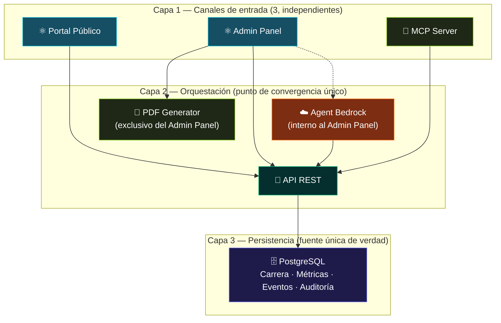

# Estrategia de Solución - Portafolio-cjhirashi

**ESTRATEGIA DE SOLUCIÓN**

---

**Última actualización**: 2026-08-16
**Resumen rápido**: 6 decisiones de alto nivel · 7 módulos organizados en 3 canales convergentes sobre una API única · comparativa contra 3 alternativas descartadas · matriz de comunicación entre los 7 contenedores

---

## 📋 Tabla de Contenidos

- [Propósito de este Documento](#-propósito-de-este-documento)
- [Decisiones Arquitectónicas de Alto Nivel](#-decisiones-arquitectónicas-de-alto-nivel)
- [Organización en Módulos](#-organización-en-módulos)
- [Comparativa Frente a Alternativas Consideradas](#-comparativa-frente-a-alternativas-consideradas)
- [Matriz de Comunicación](#-matriz-de-comunicación)
- [Trazabilidad hacia ADRs](#-trazabilidad-hacia-adrs)

---

## 🎯 Propósito de este Documento

Mientras `02-ARCHITECTURE-GOALS.md` define **qué debe lograrse** y `03-STAKEHOLDERS.md` define **para quién**, este documento explica **el camino elegido** para lograrlo: las decisiones estructurales de más alto nivel, por qué se prefirieron sobre otras alternativas razonables, y cómo se organizan los 7 módulos del sistema para satisfacerlas.

Estas decisiones son de nivel estratégico, no de detalle de implementación — el detalle de interfaces y esquemas de datos corresponde a `05-BUILDING-BLOCK-VIEW.md` y `06-RUNTIME-VIEW.md`. Ninguna decisión aquí descrita está aún formalizada como Architecture Decision Record; esa formalización es un trabajo pendiente, referenciado en la sección [Trazabilidad hacia ADRs](#-trazabilidad-hacia-adrs).

## 🧭 Decisiones Arquitectónicas de Alto Nivel

### 1. Tres canales independientes en lugar de uno único

**Decisión**: el sistema se organiza en tres puntos de entrada completamente autónomos — Portal Público, Admin Panel y MCP Server — en vez de un único frontend que sirva a todas las audiencias o de un Admin Panel que actúe como intermediario obligatorio del MCP Server.

**Motivación**: las tres audiencias del sistema (visitante anónimo, usuario administrador humano, agente de IA externo) tienen necesidades de acceso, autenticación y disponibilidad radicalmente distintas. Forzarlas a compartir un mismo canal habría acoplado su disponibilidad — por ejemplo, un agente externo no podría operar si el Admin Panel estuviera caído — y habría complicado el modelo de autorización de cada una.

**Consecuencia arquitectónica**: la API REST se convierte en el único punto de convergencia obligatorio; su disponibilidad es crítica para los tres canales por igual (ver objetivo técnico de escalabilidad horizontal en `02-ARCHITECTURE-GOALS.md`).

### 2. SPA en React para el Admin Panel

**Decisión**: el Admin Panel se construye como una aplicación de una sola página (SPA), con CRUD dinámico sobre las entidades de carrera, un panel de métricas y un chat embebido con Agent Bedrock, en vez de un panel de administración generado en servidor con recargas de página completas.

**Motivación**: el uso previsto del panel es intensivo y frecuente por parte de un único usuario (Carlos Jiménez Hirashi), que alterna constantemente entre gestión manual de datos, consulta de métricas y asistencia conversacional con Bedrock. Ese patrón de uso exige transiciones fluidas entre secciones sin la latencia de recargas de página completas.

**Consecuencia arquitectónica**: el Admin Panel consume la API REST íntegramente vía llamadas asíncronas (REST JSON), y todo el estado de sesión y navegación vive en el cliente — el servidor no mantiene estado de vista alguno.

### 3. PostgreSQL centralizado con nuevas tablas de métricas, eventos y auditoría

**Decisión**: en lugar de introducir un almacén de datos separado para observabilidad (por ejemplo, una base de series de tiempo dedicada), las métricas del MCP Agent, del Portal Público, el tracking de visitantes y los eventos de auditoría se persisten como nuevas tablas dentro de la misma instancia de PostgreSQL que ya almacena los datos de carrera profesional.

**Motivación**: el volumen de eventos esperado (un único usuario administrador, tráfico de portafolio personal, un número acotado de agentes externos) no justifica la complejidad operativa de un segundo motor de base de datos. Mantener todo en PostgreSQL simplifica el despliegue, el respaldo y la coherencia transaccional entre datos de negocio y datos de observabilidad.

**Consecuencia arquitectónica**: el modelo de datos de PostgreSQL crece para incluir entidades de métricas, eventos y auditoría junto a las de carrera profesional; el diseño de esas tablas y su posible necesidad futura de particionado es un tema pendiente de `05-BUILDING-BLOCK-VIEW.md`.

### 4. API REST como orquestador único

**Decisión**: la API REST no solo expone operaciones CRUD de negocio, sino que también concentra los endpoints de gestión y los endpoints de métricas — es decir, todo dato que necesita el Admin Panel, el MCP Server o el Portal Público pasa exclusivamente por este componente, sin excepciones.

**Motivación**: mantener un único orquestador evita la duplicación de lógica de acceso a datos en cada canal y garantiza que las reglas de negocio (por ejemplo, qué contenido es publicable) se apliquen de forma consistente sin importar desde dónde se originó la solicitud.

**Consecuencia arquitectónica**: la API REST concentra toda la carga de los tres canales, lo que la convierte en el componente de mayor prioridad para el objetivo técnico de escalabilidad horizontal (ver `02-ARCHITECTURE-GOALS.md`).

### 5. Agent Bedrock como asistente interno, no como canal

**Decisión**: Agent Bedrock se implementa como una capacidad embebida y exclusiva del Admin Panel — sin puerto propio, sin exposición a Internet y sin posibilidad de ser invocado fuera de una sesión ya autenticada — en lugar de convertirlo en un cuarto canal de acceso al sistema.

**Motivación**: Bedrock existe para asistir al usuario humano dentro de su flujo de trabajo, no para ofrecer una vía de acceso alternativa. Convertirlo en un canal propio duplicaría innecesariamente la superficie de autenticación y de autorización que ya resuelve el MCP Server para agentes de IA externos.

**Consecuencia arquitectónica**: Bedrock hereda siempre el contexto de autorización de la sesión del Admin Panel que lo invoca — nunca tiene un alcance de permisos propio y distinto (ver Modelo de Seguridad en `01-INTRODUCTION.md`).

### 6. MCP Server expuesto para agentes externos

**Decisión**: el MCP Server se mantiene como un canal completo, expuesto e independiente (puerto 8004), retomando y confirmando el rol que ya tenía en la versión anterior del proyecto, en lugar de subordinarlo al Admin Panel o eliminarlo del nuevo alcance de portafolio.

**Motivación**: uno de los tres objetivos de negocio del proyecto (ver `02-ARCHITECTURE-GOALS.md`) es explícitamente habilitar que agentes de IA externos gestionen la carrera profesional de forma autónoma; eliminar o subordinar este canal habría contradicho ese objetivo desde el diseño.

**Consecuencia arquitectónica**: el MCP Server exige su propio mecanismo de autenticación y, potencialmente, controles adicionales de autorización dado que opera sin supervisión humana en tiempo real — ambos puntos permanecen como preguntas abiertas en `01-INTRODUCTION.md`.

## 🧩 Organización en Módulos

Los 7 contenedores del sistema se agrupan en tres capas funcionales. Esta agrupación es una lente estratégica sobre la misma topología descrita en detalle en `01-INTRODUCTION.md` — no introduce componentes nuevos, sino que explica el criterio de organización detrás de ellos.

| Capa | Módulos | Criterio de organización |
|------|---------|-----------------------------|
| **Capa 1 — Canales de entrada** | Portal Público, Admin Panel, MCP Server | Cada módulo responde a una audiencia distinta y no depende de los otros dos módulos de su misma capa |
| **Capa 2 — Orquestación** | API REST, Agent Bedrock, PDF Generator | Concentra reglas de negocio y servicios de apoyo; ningún módulo de esta capa es alcanzable directamente desde fuera de la red interna, salvo la API REST a través de los canales de la Capa 1 |
| **Capa 3 — Persistencia** | PostgreSQL | Fuente única de verdad; solo la API REST tiene acceso de lectura/escritura sobre ella |

## ⚖️ Comparativa Frente a Alternativas Consideradas

| Decisión adoptada | Alternativa considerada | Por qué se descartó |
|---------------------|----------------------------|------------------------|
| Tres canales independientes (Portal, Admin, MCP) | Un único frontend multipropósito que sirva contenido público y panel de administración desde la misma aplicación | Habría acoplado la disponibilidad y el modelo de autenticación de audiencias con necesidades opuestas (visitante anónimo vs. usuario autenticado), y habría complicado el aislamiento de datos publicables frente a datos privados de carrera |
| MCP Server como canal autónomo, sin pasar por el Admin Panel | MCP Server como herramienta interna invocada únicamente desde el Admin Panel (análoga a Agent Bedrock) | Habría contradicho directamente el objetivo de negocio de permitir operación autónoma de agentes externos sin que Carlos Jiménez Hirashi esté usando el panel en ese momento |
| PostgreSQL centralizado también para métricas, eventos y auditoría | Un almacén de series de tiempo o de eventos dedicado (por ejemplo, para tracking de visitantes o auditoría) | El volumen esperado de eventos no justifica la complejidad operativa adicional de un segundo motor de datos para un sistema de un único usuario administrador; se prioriza simplicidad operativa sobre un rendimiento de escritura que no es un cuello de botella previsible en este alcance |
| Agent Bedrock sin puerto ni exposición propia | Agent Bedrock como microservicio propio, con su propio endpoint interno | Habría introducido una superficie de red adicional sin necesidad real, dado que Bedrock nunca actúa fuera del contexto de una sesión ya autenticada del Admin Panel |

## 🔀 Matriz de Comunicación

Quién se comunica con quién, y bajo qué protocolo — vista consolidada de las interfaces ya descritas por componente en `01-INTRODUCTION.md`.

| Origen | Destino | Protocolo | Autenticación |
|--------|---------|-----------|-----------------|
| Visitante anónimo | Portal Público | HTTPS (navegador) | Ninguna |
| Carlos Jiménez Hirashi | Admin Panel | HTTPS (navegador) | Sesión autenticada |
| Agente de IA externo | MCP Server | Protocolo MCP | Mecanismo propio del canal (pendiente de definir, ver `01-INTRODUCTION.md`) |
| Portal Público | API REST | REST JSON | Ninguna (solo lectura) |
| Admin Panel | API REST | REST JSON | Token de sesión del Admin Panel |
| Admin Panel | Agent Bedrock | Invocación interna (misma sesión, sin red externa) | Heredada de la sesión del Admin Panel |
| Agent Bedrock | API REST | REST JSON | Token heredado de la sesión del Admin Panel que lo invocó |
| Admin Panel | PDF Generator | Petición de renderizado | Interna, restringida por red |
| MCP Server | API REST | REST JSON | Mecanismo propio del canal (pendiente de definir) |
| API REST | PostgreSQL | SQL (vía SQLAlchemy async / asyncpg) | Credenciales de servicio, internas a la red Docker |

**Conexiones deliberadamente ausentes de esta matriz** (ya explicadas en detalle en `01-INTRODUCTION.md`): MCP Server ↔ Admin Panel, MCP Server ↔ Agent Bedrock, Agent Bedrock ↔ cualquier componente que no sea la API REST, Portal Público ↔ Admin Panel/Bedrock/MCP Server/PDF Generator, y cualquier componente ↔ PostgreSQL salvo la API REST.

## 📎 Trazabilidad hacia ADRs

Ninguna de las seis decisiones descritas en este documento está aún formalizada como Architecture Decision Record — actualmente viven únicamente como narrativa en `01-INTRODUCTION.md` y en esta estrategia. Antes de avanzar a `05-BUILDING-BLOCK-VIEW.md`, el Arquitecto de Soluciones debe decidir cuáles de estas seis decisiones ameritan un ADR propio en `docs/09-DECISIONS/`; como mínimo, son candidatas naturales:

1. Independencia de los tres canales (decisión 1)
2. Mecanismo de autenticación del MCP Server, aún sin resolver (ligado a la decisión 6 y a la pregunta abierta correspondiente en `01-INTRODUCTION.md`)
3. Centralización de métricas y auditoría en PostgreSQL en lugar de un almacén dedicado (decisión 3)

---

**Relacionado**: [01-INTRODUCTION.md](./01-INTRODUCTION.md) · [02-ARCHITECTURE-GOALS.md](./02-ARCHITECTURE-GOALS.md) · [03-STAKEHOLDERS.md](./03-STAKEHOLDERS.md) · [CLAUDE.md](../CLAUDE.md)
**Contacto**: Carlos Jiménez Hirashi (cjhirashi@gmail.com)
