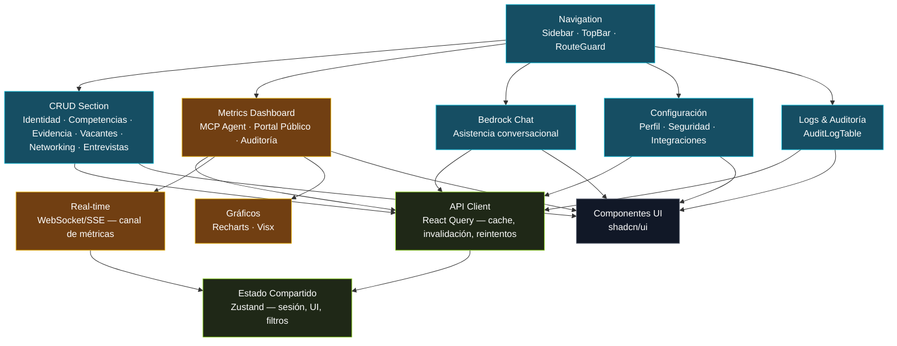
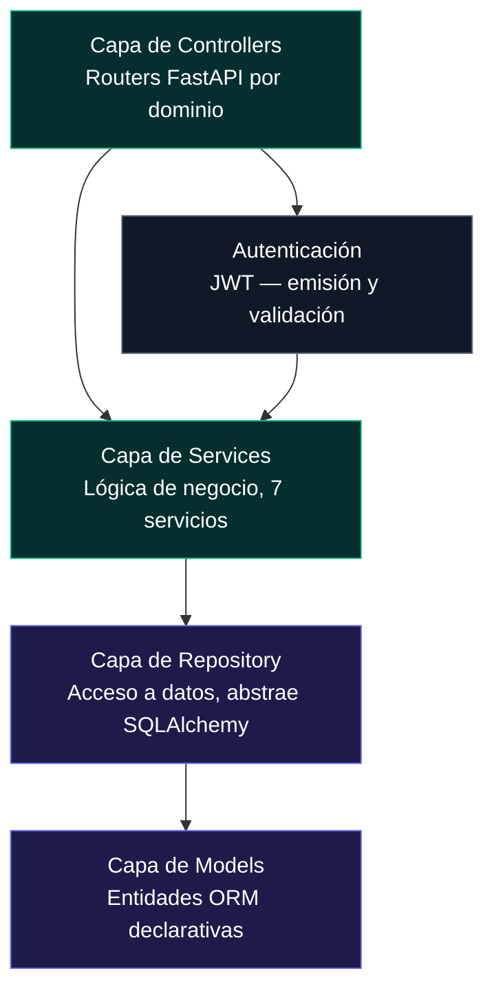
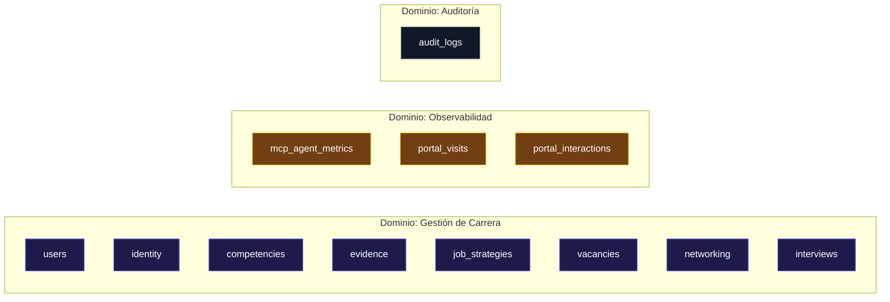
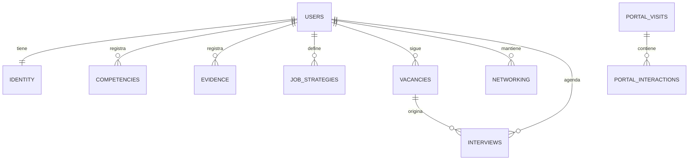

# Vista de Bloques de Construcción - Portafolio-cjhirashi

**VISTA DE BLOQUES DE CONSTRUCCIÓN**

---

**Última actualización**: 2026-08-16
**Resumen rápido**: 7 módulos de nivel 1 (ya introducidos en `01-INTRODUCTION.md`) · descomposición interna detallada de Admin Panel, API REST y PostgreSQL · 12 tablas nuevas de dominio y observabilidad · interfaces y dependencias externas por módulo

---

## 📋 Tabla de Contenidos

- [Cómo Leer Este Documento](#-cómo-leer-este-documento)
- [Nivel 1 — Sistema Completo](#-nivel-1--sistema-completo)
- [Nivel 2 — Descomposición del Admin Panel](#-nivel-2--descomposición-del-admin-panel)
- [Nivel 2 — Descomposición de la API REST](#-nivel-2--descomposición-de-la-api-rest)
- [Nivel 2 — Descomposición de PostgreSQL](#-nivel-2--descomposición-de-postgresql)
- [Interfaces entre Módulos](#-interfaces-entre-módulos)
- [Dependencias Externas](#-dependencias-externas)
- [Admin Panel Detallado](#-admin-panel-detallado)
- [Base de Datos Detallada](#-base-de-datos-detallada)
- [API REST Detallada](#-api-rest-detallada)

---

## 📖 Cómo Leer Este Documento

Este documento es la sección 5 de la documentación Arc42 y responde a **qué partes tiene cada módulo por dentro**, no *por qué* se organizó el sistema así (eso está en [04-SOLUTION-STRATEGY.md](./04-SOLUTION-STRATEGY.md)) ni *qué hace cada módulo hacia afuera* (eso ya está descrito en [01-INTRODUCTION.md — Componentes](./01-INTRODUCTION.md#-componentes)).

La descomposición sigue dos niveles:

- **Nivel 1**: los siete módulos ya presentados en `01-INTRODUCTION.md` — la unidad mínima de despliegue (un contenedor Docker, o un servicio gestionado en el caso de Agent Bedrock).
- **Nivel 2**: la descomposición interna de los tres módulos de mayor complejidad — **Admin Panel**, **API REST** y **PostgreSQL** — porque son el punto de mayor riesgo de diseño (SPA con múltiples secciones y tiempo real) y el punto único de convergencia de los tres canales, respectivamente. Portal Público, MCP Server, Agent Bedrock y PDF Generator no se descomponen en este documento porque su complejidad interna es menor y ya queda suficientemente cubierta por sus responsabilidades descritas en `01-INTRODUCTION.md`.

Este documento describe el **diseño objetivo** — la estructura acordada a construir, coherente con el alcance de portafolio profesional definido en `01-INTRODUCTION.md` a `04-SOLUTION-STRATEGY.md`. No es un inventario de código existente.

## 🧩 Nivel 1 — Sistema Completo

Los siete módulos de nivel 1 — Portal Público, Admin Panel, Agent Bedrock, MCP Server, API REST, PDF Generator y PostgreSQL —, sus responsabilidades y el diagrama de conexiones completo ya están documentados en [01-INTRODUCTION.md — Componentes](./01-INTRODUCTION.md#-componentes) y [01-INTRODUCTION.md — Diagrama del Sistema](./01-INTRODUCTION.md#-diagrama-del-sistema). Este documento no repite ese contenido; lo usa como punto de partida para descomponer los tres módulos de mayor complejidad interna.

## 🖥️ Nivel 2 — Descomposición del Admin Panel

El Admin Panel es una SPA de React que combina cinco superficies funcionales — navegación, gestión CRUD de carrera, métricas en vivo, chat con Agent Bedrock y configuración/auditoría — sobre una capa común de estado y sincronización con la API REST.

| Bloque | Responsabilidad |
|---|---|
| **Navigation** | Estructura de navegación de la SPA (sidebar, barra superior), protección de rutas (`RouteGuard`) que exige sesión autenticada antes de renderizar cualquier sección |
| **CRUD Section** | Formularios y tablas dinámicas sobre las entidades de carrera profesional — la superficie de trabajo diaria de Carlos Jiménez Hirashi |
| **Metrics Dashboard** | Visualización casi en tiempo real del uso del MCP Agent y el tráfico del Portal Público, consumiendo tanto lectura inicial vía REST como actualizaciones vía el canal de tiempo real |
| **Bedrock Chat** | Interfaz conversacional embebida que invoca a Agent Bedrock dentro de la sesión activa (ver `01-INTRODUCTION.md — Componente 4️⃣`) |
| **Configuración** | Perfil del usuario administrador, seguridad (cambio de credenciales) e integraciones (estado de Bedrock, tokens del MCP Server) |
| **Logs & Auditoría** | Consulta del registro inmutable de cambios (`audit_logs`), filtrable por canal, entidad y rango de fechas |
| **Estado Compartido** | Store de Zustand con el estado transversal de la sesión (usuario autenticado, token), preferencias de UI (tema, sidebar colapsado) y filtros activos entre secciones |
| **API Client** | Capa de React Query sobre `fetch`/`axios` que administra cache de datos de servidor, invalidación tras mutaciones y reintentos ante fallos de red |
| **Real-time** | Cliente WebSocket/SSE dedicado al canal de métricas — empuja eventos nuevos (solicitud MCP, visita del Portal) que React Query invalida o fusiona en cache sin recargar la vista |
| **Gráficos** | Recharts para las visualizaciones estándar del dashboard (series de tiempo, barras); Visx reservado para visualizaciones a medida que Recharts no cubra bien |
| **Componentes UI** | Librería de componentes shadcn/ui (Button, Table, Dialog, Tabs, Card, Sheet, Toast) como base visual consistente de las cinco secciones |

**Tecnología**: React 18 + TypeScript + Tailwind CSS + Zustand + React Query + Recharts/Visx + shadcn/ui (ver [Stack Tecnológico](./01-INTRODUCTION.md#-stack-tecnológico) y ampliación en [Admin Panel Detallado](#-admin-panel-detallado)).

## 🚀 Nivel 2 — Descomposición de la API REST

La API REST se organiza en cuatro capas horizontales, atravesadas por siete servicios de dominio que agrupan la lógica de negocio por área funcional.

| Capa | Responsabilidad |
|---|---|
| **Controllers** | Routers FastAPI que exponen los endpoints HTTP, validan el payload de entrada contra schemas Pydantic y delegan en la capa de Services — no contienen lógica de negocio |
| **Services** | Siete servicios de dominio (ver [API REST Detallada](#-api-rest-detallada)) con las reglas de negocio: validaciones cruzadas, cálculo de qué contenido es publicable, agregación de métricas |
| **Repository** | Abstracción de acceso a datos sobre SQLAlchemy 2.0 async — aísla a los Services del detalle de las consultas SQL, facilitando pruebas unitarias con dobles de prueba |
| **Models** | Entidades ORM declarativas, una por tabla (ver [Base de Datos Detallada](#-base-de-datos-detallada)) |
| **Autenticación** | Emisión y validación de JWT, compartida como dependencia transversal por los Controllers que requieren sesión autenticada |

## 🗄️ Nivel 2 — Descomposición de PostgreSQL

PostgreSQL agrupa sus tablas en tres dominios: **gestión de carrera** (el trabajo diario de Carlos Jiménez Hirashi), **observabilidad** (métricas y tracking) y **auditoría** (registro inmutable de cambios). El detalle completo de columnas, relaciones e índices está en [Base de Datos Detallada](#-base-de-datos-detallada).

## 🔗 Interfaces entre Módulos

| Origen | Destino | Interfaz | Protocolo |
|---|---|---|---|
| Portal Público | API REST | Lectura pública de contenido curado (`/api/v1/public/*`) | REST/JSON, sin autenticación |
| Portal Público (script de tracking) | API REST | Envío de eventos de visita e interacción (`POST /api/v1/events/track`) | REST/JSON, sin autenticación |
| Admin Panel | API REST | CRUD completo de carrera, lectura de métricas, auditoría | REST/JSON, token de sesión |
| Admin Panel | API REST (canal de tiempo real) | Suscripción al canal de métricas para actualizaciones en vivo | WebSocket/SSE, token de sesión |
| Admin Panel | Agent Bedrock | Invocación interna, misma sesión (ver `01-INTRODUCTION.md — Componente 4️⃣`) | Invocación en proceso, sin red externa |
| Agent Bedrock | API REST | Lectura/escritura de contexto de carrera en nombre de la sesión activa | REST/JSON, token heredado |
| Admin Panel | PDF Generator | Renderizado de CV / Cover Letter | HTTP directo, exclusivo del Admin Panel |
| MCP Server | API REST | CRUD completo de carrera, canal independiente | REST/JSON, autenticación propia del canal |
| API REST | PostgreSQL | Único lector/escritor de los tres dominios de datos | SQL vía SQLAlchemy async / asyncpg |

## 📦 Dependencias Externas

| Módulo | Dependencia | Propósito |
|---|---|---|
| Admin Panel / Portal Público | React 18, TypeScript, Vite | Renderizado de UI y tipado estático |
| Admin Panel | Tailwind CSS + shadcn/ui | Sistema de estilos y componentes UI base |
| Admin Panel | Zustand | Estado compartido en cliente (sesión, UI, filtros) |
| Admin Panel | React Query (TanStack Query) | Cache y sincronización de datos de servidor |
| Admin Panel | Recharts, Visx | Visualización de métricas en el dashboard |
| Admin Panel | Cliente WebSocket/SSE nativo o librería ligera (ej. `native-websocket`, `eventsource`) | Canal de tiempo real de métricas |
| API REST | FastAPI, SQLAlchemy 2.0 (async), asyncpg | Framework web ASGI y acceso a PostgreSQL |
| API REST | PyJWT, passlib/bcrypt | Emisión/validación de JWT, hashing de contraseñas |
| API REST | Librería de WebSocket/SSE de FastAPI (`fastapi.WebSocket` / `sse-starlette`) | Servidor del canal de tiempo real consumido por el Admin Panel |
| MCP Server | FastMCP | Framework del protocolo MCP |
| PDF Generator | WeasyPrint, Jinja2 | Renderizado de HTML a PDF y motor de plantillas |
| Agent Bedrock | SDK de AWS Bedrock (`boto3` o equivalente, invocado desde la API REST o desde un servicio intermedio) | Invocación del modelo gestionado por AWS |
| PostgreSQL | Imagen `postgres:15` | Motor de base de datos |

---

## 🖥️ Admin Panel Detallado

### Arquitectura

El Admin Panel sigue una arquitectura de tres capas clásicas de una SPA con backend remoto: **Frontend SPA** (React, corre íntegramente en el navegador de Carlos Jiménez Hirashi) → **API REST** (única puerta de entrada a datos y lógica de negocio) → **PostgreSQL** (persistencia). El Admin Panel no mantiene lógica de negocio propia más allá de validación de formularios en cliente — toda regla de negocio real (qué es publicable, límites de datos, reglas de auditoría) vive en la capa de Services de la API REST, coherente con la decisión arquitectónica de "API REST como orquestador único" (ver [04-SOLUTION-STRATEGY.md — Decisión 4](./04-SOLUTION-STRATEGY.md#4-api-rest-como-orquestador-único)).

### Funcionalidades por Sección

| # | Sección | Descripción |
|---|---------|-------------|
| 1 | **Gestión de Carrera** | CRUD dinámico sobre las entidades de carrera: Identidad Profesional, Inventario de Competencias, Evidencia (proyectos, cargos, logros, casos STAR), Estrategias de Búsqueda de Empleo, Base de Vacantes, Networking y Preparación para Entrevistas. Cada entidad tiene su propio formulario y tabla, generados a partir de un mismo patrón de CRUD dinámico para minimizar duplicación entre secciones. |
| 2 | **Métricas Dashboard** | Gráficos casi en tiempo real de tres fuentes: uso del MCP Agent (volumen de solicitudes, latencia, comandos más usados), tráfico del Portal Público (visitas, dispositivos, procedencia) y resumen de auditoría reciente. |
| 3 | **Chat Bedrock** | Interfaz conversacional para interactuar con Agent Bedrock — redactar narrativas, sugerir competencias a partir de evidencia registrada, resolver dudas sobre el propio contenido de carrera. |
| 4 | **Configuración** | Perfil del usuario administrador, seguridad (cambio de credenciales, revisión de sesiones activas) e integraciones (estado de la conexión con AWS Bedrock, gestión de tokens del MCP Server). |
| 5 | **Logs & Auditoría** | Consulta del registro inmutable de `audit_logs` — quién (o qué canal) hizo qué cambio, cuándo, y sobre qué entidad, con filtros por canal (`admin_panel`, `bedrock`, `mcp_server`) y por rango de fechas. |

### Tabla de Componentes React Principales

| Componente | Sección | Responsabilidad |
|---|---|---|
| `AppShell` | Navigation | Layout raíz — monta `Sidebar`, `TopBar` y el `RouteGuard` que exige sesión activa |
| `Sidebar` / `TopBar` | Navigation | Navegación entre las cinco secciones, indicador de estado de conexión en tiempo real |
| `EntityDataTable` (genérico) | Gestión de Carrera | Tabla reutilizable con paginación, filtros y ordenamiento, parametrizada por entidad |
| `EntityForm` (genérico) | Gestión de Carrera | Formulario reutilizable generado a partir de un esquema declarativo por entidad |
| `EvidenceStarForm` | Gestión de Carrera | Formulario especializado para casos STAR (Situación, Tarea, Acción, Resultado) dentro de Evidencia |
| `VacancyBoard` | Gestión de Carrera | Vista tipo kanban de vacantes por estado (`wishlist`, `applied`, `interviewing`, `offer`, `rejected`, `closed`) |
| `McpMetricsPanel` | Métricas Dashboard | Gráficos de solicitudes, latencia y comandos del MCP Agent |
| `PortalTrafficPanel` | Métricas Dashboard | Gráficos de visitas e interacciones del Portal Público |
| `RealtimeIndicator` | Métricas Dashboard | Estado de la conexión WebSocket/SSE (conectado, reconectando, caído) |
| `ChatWindow` / `MessageList` / `PromptInput` | Chat Bedrock | Interfaz conversacional completa con Agent Bedrock |
| `ProfileSettings` / `SecuritySettings` / `IntegrationsSettings` | Configuración | Formularios de configuración del usuario administrador |
| `AuditLogTable` / `AuditLogFilter` | Logs & Auditoría | Tabla filtrable del registro de auditoría |

### Endpoints API Consumidos por el Admin Panel

| Método | Ruta | Sección que lo consume |
|---|---|---|
| POST | `/api/v1/auth/login` | Autenticación al abrir sesión |
| GET/POST/PUT/DELETE | `/api/v1/identity`, `/api/v1/competencies`, `/api/v1/evidence`, `/api/v1/job-strategies`, `/api/v1/vacancies`, `/api/v1/networking`, `/api/v1/interviews` | Gestión de Carrera |
| GET | `/api/v1/metrics/mcp`, `/api/v1/metrics/portal` | Métricas Dashboard (carga inicial) |
| WS/SSE | `/api/v1/metrics/stream` | Métricas Dashboard (actualizaciones en vivo) |
| POST/GET | Endpoints internos de Agent Bedrock, resueltos vía la API REST en nombre de la sesión activa | Chat Bedrock |
| GET/PUT | `/api/v1/auth/profile`, `/api/v1/auth/password` | Configuración |
| GET | `/api/v1/audit` | Logs & Auditoría |

### Tecnologías

React 18 · TypeScript · Tailwind CSS · Zustand · React Query (TanStack Query) · Recharts / Visx · shadcn/ui — ver la justificación de SPA en React para el Admin Panel en [04-SOLUTION-STRATEGY.md — Decisión 2](./04-SOLUTION-STRATEGY.md#2-spa-en-react-para-el-admin-panel).

---

## 🗄️ Base de Datos Detallada

### Tablas de Gestión de Carrera

| Tabla | Propósito | Relación principal |
|---|---|---|
| `users` | Credenciales del usuario administrador (hoy, un único registro) | Raíz de las demás tablas de carrera vía `user_id` |
| `identity` | Identidad profesional: nombre, titular, resumen, contacto, enlaces | 1:1 con `users` |
| `competencies` | Inventario de competencias (categoría, nivel, años de experiencia, si es publicable) | N:1 con `users` |
| `evidence` | Proyectos, cargos, logros y casos STAR que respaldan las competencias | N:1 con `users`; referencia lógica a `competencies` |
| `job_strategies` | Estrategias de búsqueda de empleo (roles objetivo, enfoque) | N:1 con `users` |
| `vacancies` | Vacantes en seguimiento, con estado del proceso | N:1 con `users` |
| `networking` | Contactos profesionales y su relación con la búsqueda de empleo | N:1 con `users` |
| `interviews` | Entrevistas programadas o realizadas, ligadas a una vacante | N:1 con `users`; N:1 con `vacancies` |

### Tablas de Observabilidad

| Tabla | Propósito |
|---|---|
| `mcp_agent_metrics` | Una fila por solicitud atendida por el MCP Server: herramienta invocada, latencia, resultado (éxito/error) |
| `portal_visits` | Una fila por sesión de visita al Portal Público: geolocalización aproximada, tipo de dispositivo, navegador, referente |
| `portal_interactions` | Eventos dentro de una visita (`pageview`, `click`, `download`, `time_on_page`), ligados a `portal_visits` |

### Tabla de Auditoría

| Tabla | Propósito |
|---|---|
| `audit_logs` | Registro inmutable de cada cambio relevante, con el canal de origen (`admin_panel`, `bedrock`, `mcp_server`), la entidad afectada y el estado antes/después |

### Relaciones e Índices Clave

| Índice | Tabla | Motivo |
|---|---|---|
| `idx_competencies_user_id`, `idx_evidence_user_id`, `idx_vacancies_user_id`, `idx_networking_user_id`, `idx_interviews_user_id` | Tablas de carrera | Toda consulta de gestión de carrera filtra por `user_id`; son las consultas más frecuentes del Admin Panel |
| `idx_vacancies_status` | `vacancies` | Soporta la vista tipo kanban (`VacancyBoard`), que agrupa por estado |
| `idx_evidence_type` | `evidence` | Filtro habitual por tipo (proyecto, cargo, logro, caso STAR) |
| `idx_mcp_metrics_request_at` | `mcp_agent_metrics` | Consultas de rango de fecha para el dashboard de métricas |
| `idx_portal_visits_visited_at` | `portal_visits` | Consultas de rango de fecha para el dashboard de tráfico |
| `idx_portal_interactions_visit_id` | `portal_interactions` | Join frecuente con `portal_visits` para reconstruir el recorrido de una visita |
| `idx_audit_logs_entity` (compuesto `entity_type`, `entity_id`) | `audit_logs` | Consulta habitual: "historial de cambios de esta entidad concreta" |
| `idx_audit_logs_occurred_at` | `audit_logs` | Consultas de rango de fecha para Logs & Auditoría |

**Nota de diseño**: todas las tablas de gestión de carrera aíslan sus datos por `user_id`, aun cuando el sistema tiene hoy un único usuario administrador — esto sostiene el objetivo técnico de "aislamiento de datos por usuario" priorizado en [02-ARCHITECTURE-GOALS.md](./02-ARCHITECTURE-GOALS.md#-objetivos-técnicos) y deja el modelo preparado si en el futuro se reevalúa un escenario multiusuario, sin que eso implique que dicho escenario esté planeado hoy.

---

## 🚀 API REST Detallada

### Capas

Ver el diagrama de capas en [Nivel 2 — Descomposición de la API REST](#-nivel-2--descomposición-de-la-api-rest). Los siete servicios de dominio que viven en la capa de Services son:

| Servicio | Entidades que gestiona |
|---|---|
| `AuthService` | `users` — login, emisión/validación de JWT, cambio de contraseña |
| `IdentityService` | `identity` |
| `CompetencyEvidenceService` | `competencies`, `evidence` |
| `JobSearchService` | `job_strategies`, `vacancies`, `networking`, `interviews` |
| `MetricsService` | `mcp_agent_metrics`, `portal_visits`, `portal_interactions` — agregación de lectura para el dashboard |
| `EventTrackingService` | `portal_visits`, `portal_interactions` — ingesta de eventos del script de tracking del Portal Público |
| `AuditService` | `audit_logs` — escritura transversal (invocada por los demás servicios tras cada mutación) y lectura filtrada |

### Rutas Expuestas

| Prefijo | Método(s) | Descripción | Autenticación |
|---|---|---|---|
| `/api/v1/auth/*` | POST, GET, PUT | Login, perfil, cambio de contraseña | Login sin auth; el resto requiere JWT |
| `/api/v1/identity/*` | GET, PUT | Identidad profesional | JWT |
| `/api/v1/competencies/*` | GET, POST, PUT, DELETE | Inventario de competencias | JWT |
| `/api/v1/evidence/*` | GET, POST, PUT, DELETE | Evidencia (proyectos, cargos, logros, STAR) | JWT |
| `/api/v1/job-strategies/*` | GET, POST, PUT, DELETE | Estrategias de búsqueda | JWT |
| `/api/v1/vacancies/*` | GET, POST, PUT, DELETE | Vacantes en seguimiento | JWT |
| `/api/v1/networking/*` | GET, POST, PUT, DELETE | Contactos profesionales | JWT |
| `/api/v1/interviews/*` | GET, POST, PUT, DELETE | Entrevistas | JWT |
| `/api/v1/metrics/*` | GET, WS/SSE | Lectura agregada y canal de tiempo real de métricas | JWT |
| `/api/v1/events/track` | POST | Ingesta de eventos del Portal Público | Sin autenticación (canal público, con controles de red) |
| `/api/v1/audit/*` | GET | Consulta del registro de auditoría | JWT |
| `/api/v1/public/*` | GET | Contenido publicable consumido por el Portal Público (perfil, proyectos, blog) | Sin autenticación |

### Autenticación

JWT en el header `Authorization: Bearer <token>`, emitido por `POST /api/v1/auth/login` y validado en cada endpoint protegido — mismo mecanismo ya descrito en [01-INTRODUCTION.md — Modelo de Seguridad](./01-INTRODUCTION.md#-modelo-de-seguridad). El MCP Server usa un mecanismo de autenticación propio e independiente del JWT del Admin Panel (pendiente de definir, ver [01-INTRODUCTION.md — Preguntas de Validación Abiertas](./01-INTRODUCTION.md#-preguntas-de-validación-abiertas)); el endpoint de tracking (`/api/v1/events/track`) y los endpoints públicos (`/api/v1/public/*`) no requieren autenticación por diseño, al servir a audiencias no autenticadas del Portal Público.

---

**Relacionado**: [01-INTRODUCTION.md](./01-INTRODUCTION.md) · [04-SOLUTION-STRATEGY.md](./04-SOLUTION-STRATEGY.md) · [06-RUNTIME-VIEW.md](./06-RUNTIME-VIEW.md) · [08-CROSSCUTTING-CONCEPTS.md](./08-CROSSCUTTING-CONCEPTS.md) · [CLAUDE.md](../CLAUDE.md)
**Contacto**: Carlos Jiménez Hirashi (cjhirashi@gmail.com)
