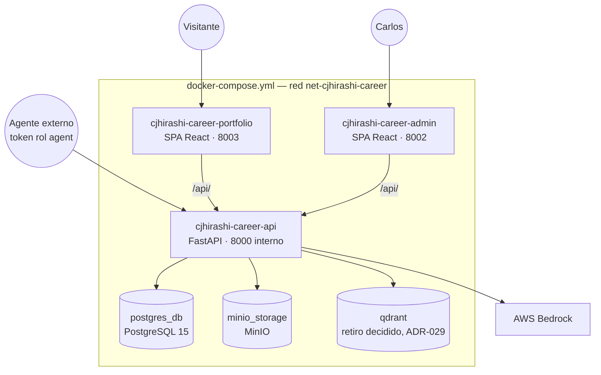

# Vista de bloques de construcción - cjhirashi-career

> **Estado (2026-11-10, [ADR-032](09-DECISIONS/032-agentes-externos-y-bedrock-fuera-de-operacion.md)):** el subsistema de agentes con AWS Bedrock está **fuera de operación**. Los agentes de IA son externos y entran por la API con el rol `agent`. Este documento se conserva como referencia del diseño y no describe el comportamiento operativo actual.

**VISTA DE BLOQUES** (arc42, sección 5)

**Última actualización**: 2026-11-10
**Resumen**: nivel 1 (los contenedores) y nivel 2 (Admin Panel, Portal, API y base de datos). Para no duplicar, el detalle de cada servicio vive en su propio README y en `cjhirashi-career-api/docs/` (referenciados abajo).

---

## Nivel 1 — Sistema completo

```mermaid
graph TB
    Visitante((Visitante)) --> Portal
    Carlos((Carlos)) --> Admin
    Agente((Agente externo<br/>token rol agent)) --> API

    subgraph Compose["docker-compose.yml — red net-cjhirashi-career"]
        Portal["cjhirashi-career-portfolio<br/>SPA React · 8003"]
        Admin["cjhirashi-career-admin<br/>SPA React · 8002"]
        API["cjhirashi-career-api<br/>FastAPI · 8000 interno"]
        PG[("postgres_db<br/>PostgreSQL 15")]
        S3[("minio_storage<br/>MinIO")]
        Q[("qdrant<br/>retiro decidido, ADR-029")]
    end

    Portal -->|/api/| API
    Admin -->|/api/| API
    API --> PG
    API --> S3
    API --> Q
    API --> AWS["AWS Bedrock"]
```

| Bloque | Responsabilidad | Documentación |
|---|---|---|
| **Portal público** | Lectura del portafolio, formulario de contacto, rastreador de analítica | [`cjhirashi-career-portfolio/README.md`](../cjhirashi-career-portfolio/README.md) |
| **Admin Panel** | Gestión de carrera, vacantes, archivos, PDF, métricas, mensajes, agentes | [`cjhirashi-career-admin/README.md`](../cjhirashi-career-admin/README.md) |
| **API REST** | Autenticación, CRUD, Bedrock, PDF, archivos, analítica; dueña del esquema | [`cjhirashi-career-api/README.md`](../cjhirashi-career-api/README.md), [`docs/API.md`](../cjhirashi-career-api/docs/API.md), [`docs/ARCHITECTURE.md`](../cjhirashi-career-api/docs/ARCHITECTURE.md) |
| **PostgreSQL** | Persistencia de todo el negocio | [`docs/DATABASE.md`](../cjhirashi-career-api/docs/DATABASE.md) |
| **MinIO** | Archivos (bucket único; los públicos se sirven como archivos públicos) | [ENVIRONMENT-SECURITY.md](./ENVIRONMENT-SECURITY.md) |
| **Qdrant** | Base de conocimiento vectorial de Agent Bedrock (se retira en la etapa 3 de la spec 009) | [BEDROCK-SYSTEM.md](./BEDROCK-SYSTEM.md) |
| **`cjhirashi-career-ai`** | Harness de agentes (spec 009); **no desplegado**: sin servicio en el compose | [`cjhirashi-career-ai/README.md`](../cjhirashi-career-ai/README.md) |

## Nivel 2 — Admin Panel

SPA React 18 + Vite + TypeScript (Tailwind, React Query, Zustand, React Router, Recharts). Capas: `pages/` y `components/` → `hooks/` → `api/` (cliente Axios tipado con interceptores JWT) → `stores/`.

| Área | Rutas | Contenido |
|---|---|---|
| Panel y métricas | `/dashboard`, `/metrics`, `/metrics/settings`, `/search-metrics` | KPIs de búsqueda; analítica del portafolio con comparación, filtros, metas, embudos y anotaciones |
| Carrera | `/career/:resourceKey/:recordSlug?`, `/job-discovery`, `/files` | Vista genérica de cada recurso de carrera (`config/careerResources.ts`), descubrimiento de vacantes y archivos |
| Tareas | `/tasks` | Lista, kanban, calendario y Gantt |
| Agentes | `/agent/chat`, `/agent/catalog`, `/agent/instructions`, `/agent/tools`, `/agent/memory`, `/agent/tasks`, `/agent/audit-log`, `/agent/metrics`, `/agent/pdf-templates`, `/agent/pdf-template-styles` | Chat, catálogo y configuración de agentes, memoria, tareas programadas, auditoría y plantillas de PDF |
| Configuración | `/settings/agents`, `/settings/sections`, `/settings/agent-prompts`, `/settings/error-reports` | Perfiles de agentes, secciones del Admin, prompts globales y registro de errores |
| Cuenta | `/login`, `/profile`, `/change-password` | Autenticación |

Componentes compartidos: `section/` (plantilla de tabla, ADR-020), `career/` (formularios y vistas de recursos), `bedrock/` (chat), `tasks/` (vistas de tareas), selectores temáticos y la campana de notificaciones (incluye los mensajes de contacto). Detalle: README del Admin.

## Nivel 2 — Portal público

SPA React sin estado de negocio: `/`, `/about`, `/projects`, `/projects/:slug`, `/blog`, `/blog/:slug`, `/contact`, `/privacy` y 404. Lee de `/api/public/*`; envía el formulario de contacto y los eventos de analítica (tiempo activo, scroll, enlaces salientes, Web Vitals, UTM; respeta DNT/GPC). `/privacy` permite al visitante borrar sus datos.

## Nivel 2 — API REST

Capas: `routes/` → `services/` → `repositories/` → `models/` (la lógica de negocio vive en `services/`). 419 operaciones HTTP en 282 rutas.

| Dominio | Módulos de ruta | Servicios principales |
|---|---|---|
| Autenticación y usuarios | `auth_enhanced` | `auth_service` (JWT, bcrypt) |
| Carrera (CRUD genérico `/career/{recurso}`) | `career_identity`, `career_search`, `career_digital`, `career_support`, `career_methodologies`, `career_common` | `career_repository` (base común), `vacancy_stage`, `methodology_scope`, `section_catalog` |
| Métricas y descubrimiento | `career_metrics`, `job_discovery` | `services/job_discovery/` (adaptadores Adzuna, Greenhouse, Lever, LinkedIn, Remotive, RemoteOK, GetOnBoard) |
| Agentes | `bedrock`, `bedrock_tasks`, `notifications` | `services/bedrock/` (bucle, perfiles, herramientas, memoria, costos, imágenes), `task_scheduler`, `web_search_service`, `github_service` |
| Archivos y PDF | `files`, `pdf_templates`, `pdf_template_styles` | `storage_service`, `pdf_service`, `pdf_template_render` |
| Portal y analítica | `public`, `events`, `portal_metrics`, `portal_analytics`, `admin_contact_messages` | `portal_ingest`, `portal_metrics`, `portal_bots`, `portal_geo`, `portal_channels`, `portal_device`, `portal_ratelimit`, `contact_message_service` |
| Operación | `admin_sections`, `error_reports` | `admin_sections`, `error_report_service` |

Autorización: `middleware/auth.py` valida el JWT y restringe el rol `agent` a `/career/*`, `POST /bedrock/chat` y `POST /files`. Errores como `{"detail": …}` (los 422 de validación añaden la lista de errores); todo fallo relevante se registra en `error_reports` (ADR-018). Programación de tareas de agentes: bucle in-process (`task_scheduler`) iniciado en el arranque.

## Nivel 2 — PostgreSQL

Una instancia (`postgres_db`) con la base `career_db`: 69 modelos SQLAlchemy y 53 migraciones Alembic (head `6b2d8f4a1c57`). Dominios: usuarios y sesiones; carrera (identidad, búsqueda y vacantes, presencia digital, soporte y metodologías); Agent Bedrock (perfiles, conversaciones, tareas, uso, costos); archivos; analítica del portafolio (`portal_*`); observabilidad (`audit_logs`, `error_reports`, `events`, `user_notifications`); y mensajes de contacto. El esquema, los IDs prefijados y las migraciones están en [`DATABASE.md`](../cjhirashi-career-api/docs/DATABASE.md), que es la fuente de verdad.

## Interfaces entre bloques

| Origen → Destino | Interfaz |
|---|---|
| Portal / Admin → API | REST JSON bajo `/api/` (la API recibe la ruta sin el prefijo); Admin con `Authorization: Bearer`, Portal sin autenticación |
| API → PostgreSQL | SQLAlchemy async (asyncpg) |
| API → MinIO | Cliente S3 `minio`, bucket único |
| API → Qdrant | `qdrant-client` (6333) |
| API → AWS Bedrock | boto3: Converse (chat), embeddings e imágenes |

## Dependencias externas

| Dependencia | Uso | Credenciales |
|---|---|---|
| AWS Bedrock | Chat de agentes, embeddings e imágenes (Stability) | `AWS_ACCESS_KEY_ID`, `AWS_SECRET_ACCESS_KEY` |
| Adzuna, Greenhouse, Lever, LinkedIn (URL oficial), Remotive y otras | Descubrimiento de vacantes | `ADZUNA_APP_ID`, `ADZUNA_APP_KEY` (el resto, API públicas) |
| GitHub | Lectura de repositorios por el agente | `GITHUB_TOKEN` |
| Brave Search | Consulta web del agente | `BRAVE_SEARCH_API_KEY` |

---

**Relacionado**: [01-INTRODUCTION.md](./01-INTRODUCTION.md) · [04-SOLUTION-STRATEGY.md](./04-SOLUTION-STRATEGY.md) · [06-RUNTIME-VIEW.md](./06-RUNTIME-VIEW.md) · [07-DEPLOYMENT-VIEW.md](./07-DEPLOYMENT-VIEW.md)
**Contacto**: cjhirashi@gmail.com
