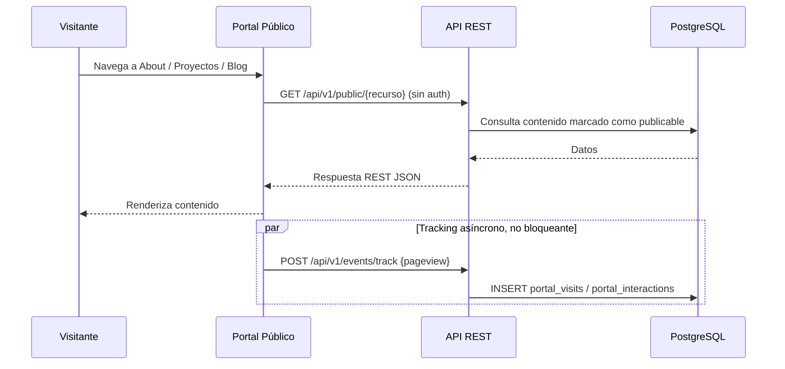
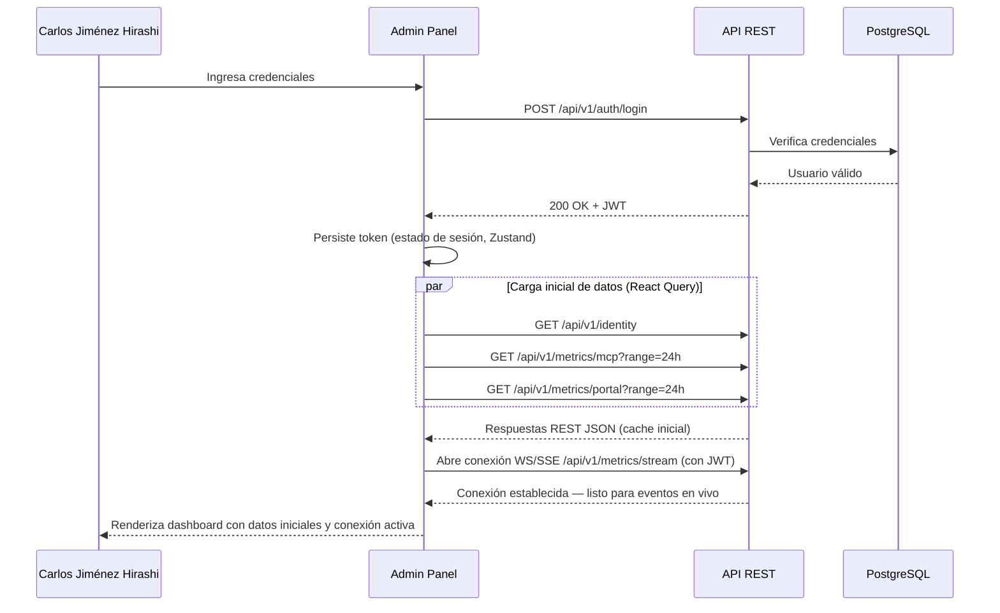
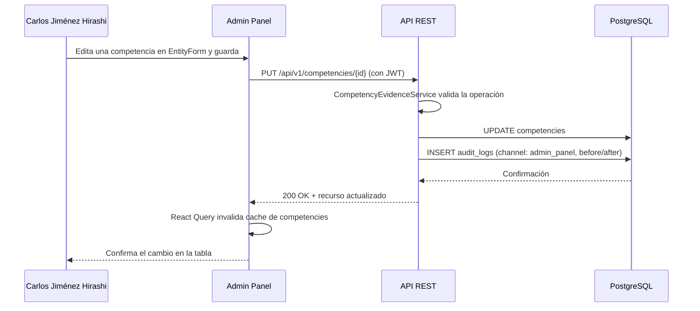
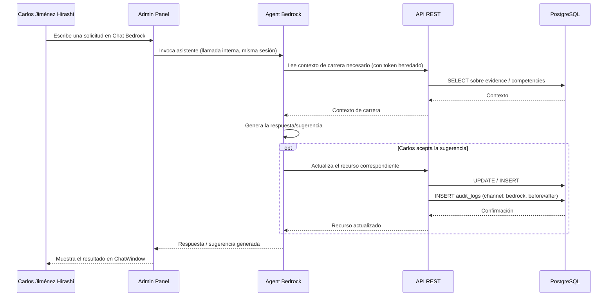
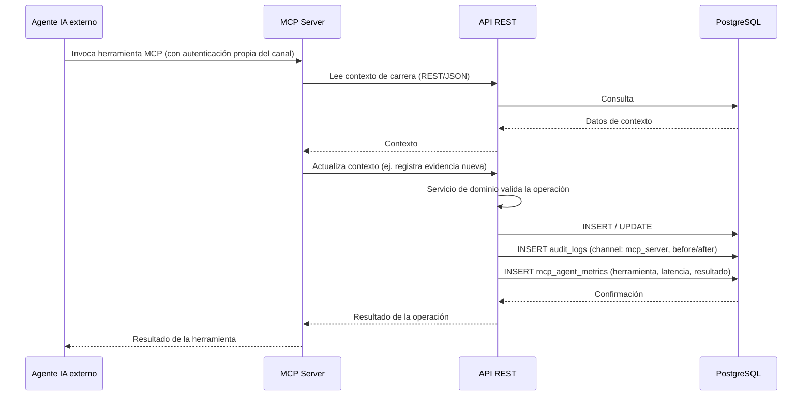
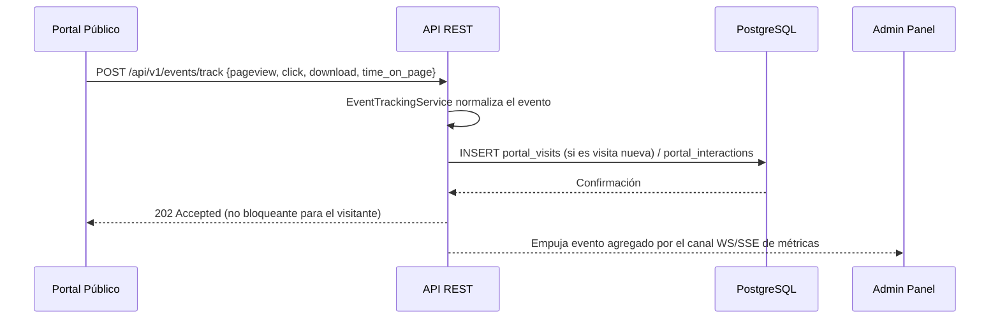
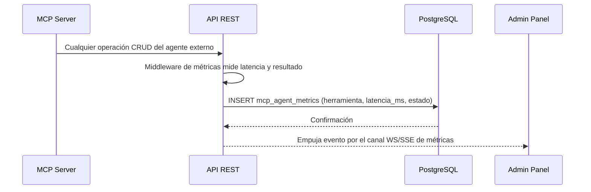

# Vista de Tiempo de Ejecución - Portafolio-cjhirashi

**VISTA DE TIEMPO DE EJECUCIÓN**

---

**Última actualización**: 2026-08-16
**Resumen rápido**: 5 escenarios de flujo completo (Portal Público, apertura de sesión, CRUD directo, asistencia Bedrock, agente MCP autónomo) · flujo detallado de métricas en tiempo real · latencias objetivo por tipo de operación

---

## 📋 Tabla de Contenidos

- [Cómo Leer Este Documento](#-cómo-leer-este-documento)
- [Escenario 1 — Visitante Consulta el Portal Público](#-escenario-1--visitante-consulta-el-portal-público)
- [Escenario 2 — Carlos Abre el Admin Panel](#-escenario-2--carlos-abre-el-admin-panel)
- [Escenario 3 — Carlos Edita una Competencia](#-escenario-3--carlos-edita-una-competencia)
- [Escenario 4 — Carlos Usa Agent Bedrock](#-escenario-4--carlos-usa-agent-bedrock)
- [Escenario 5 — Agente Externo Opera vía MCP Server](#-escenario-5--agente-externo-opera-vía-mcp-server)
- [Métricas en Tiempo Real](#-métricas-en-tiempo-real)
- [Comparación de Escenarios](#-comparación-de-escenarios)

---

## 📖 Cómo Leer Este Documento

Este documento es la sección 6 de la documentación Arc42 y describe **cómo fluyen los datos en tiempo de ejecución** para los cinco casos de uso principales del sistema. Complementa a [05-BUILDING-BLOCK-VIEW.md](./05-BUILDING-BLOCK-VIEW.md) (qué partes tiene cada módulo) mostrando cómo esas partes interactúan cuando el sistema está corriendo. Es el **diseño objetivo** acordado por el Arquitecto de Soluciones, coherente con [01-INTRODUCTION.md](./01-INTRODUCTION.md) y [04-SOLUTION-STRATEGY.md](./04-SOLUTION-STRATEGY.md) — no describe una implementación existente.

Cada escenario corresponde a uno de los tres canales de entrada (Portal Público, Admin Panel, MCP Server) descritos en `01-INTRODUCTION.md`, con especial atención a las dos formas de operar el Admin Panel (manual y asistida por Bedrock), que son estructuralmente distintas aunque compartan el mismo canal.

## 🌐 Escenario 1 — Visitante Consulta el Portal Público

Un visitante anónimo navega al Portal Público para conocer el perfil profesional de Carlos Jiménez Hirashi. El flujo es de solo lectura, sin autenticación, y dispara en paralelo un evento de tracking que alimenta las métricas del Admin Panel.

**Componentes involucrados**: Portal Público, API REST (`EventTrackingService` para el evento, resto de servicios para el contenido publicable), PostgreSQL.

**Pasos:**
1. El visitante navega a una sección pública sin necesidad de autenticarse.
2. El Portal Público solicita el contenido correspondiente a `/api/v1/public/*`, en modo exclusivamente de lectura.
3. La API REST consulta PostgreSQL y retorna únicamente los datos marcados como publicables, sin importar por cuál de los tres canales fueron escritos originalmente.
4. En paralelo, y sin bloquear el renderizado, el script de tracking del Portal Público envía un evento de visita — ver [Tracking en Portal Público](./08-CROSSCUTTING-CONCEPTS.md#-tracking-en-portal-público).

## 🔐 Escenario 2 — Carlos Abre el Admin Panel

Carlos Jiménez Hirashi abre el Admin Panel: se autentica, la SPA carga los datos iniciales de las cinco secciones y establece la conexión de tiempo real para el dashboard de métricas.

**Componentes involucrados**: Admin Panel (Navigation, Estado Compartido, API Client, Real-time), API REST (`AuthService`, `MetricsService`), PostgreSQL.

**Pasos:**
1. Carlos Jiménez Hirashi se autentica; la API REST emite un JWT tras validar credenciales.
2. La SPA carga en paralelo los datos iniciales de las secciones más usadas (identidad, resumen de métricas) vía React Query, que administra la cache resultante.
3. El Admin Panel abre la conexión de tiempo real (`/api/v1/metrics/stream`) autenticada con el mismo JWT, dejando el dashboard listo para recibir actualizaciones sin que el usuario tenga que refrescar la página.

## ✏️ Escenario 3 — Carlos Edita una Competencia

Gestión manual directa: Carlos opera un formulario del Admin Panel sin invocar ninguna asistencia de IA. Es el flujo CRUD más simple y el más frecuente del sistema.

**Componentes involucrados**: Admin Panel (CRUD Section, API Client), API REST (`CompetencyEvidenceService`, `AuditService`), PostgreSQL.

**Pasos:**
1. Carlos Jiménez Hirashi edita el formulario correspondiente y confirma el guardado.
2. El Admin Panel envía la operación a la API REST con su token de sesión.
3. `CompetencyEvidenceService` valida y persiste el cambio; en el mismo ciclo de la solicitud, `AuditService` registra la entrada correspondiente en `audit_logs` con el estado anterior y el nuevo.
4. React Query invalida la cache local de la entidad afectada, refrescando la tabla sin recarga de página.

## 🤝 Escenario 4 — Carlos Usa Agent Bedrock

Gestión asistida: Carlos pide ayuda a Agent Bedrock dentro de la misma sesión del Admin Panel — por ejemplo, para redactar una narrativa a partir de evidencia ya registrada.

**Componentes involucrados**: Admin Panel (Bedrock Chat), Agent Bedrock, API REST (servicio de dominio correspondiente al recurso afectado, `AuditService`), PostgreSQL.

**Pasos:**
1. Carlos Jiménez Hirashi, ya autenticado, solicita asistencia dentro del Chat Bedrock.
2. El Admin Panel invoca a Agent Bedrock de forma interna — no hay salida de red hacia un canal externo distinto.
3. Agent Bedrock lee el contexto de carrera necesario en la API REST, en nombre de la sesión activa, y genera su respuesta.
4. Si Carlos acepta una sugerencia que implica escritura, Agent Bedrock actualiza el recurso vía API REST; el cambio queda registrado en `audit_logs` con canal `bedrock`, distinguiéndolo de una edición manual.

## 🤖 Escenario 5 — Agente Externo Opera vía MCP Server

Un agente de IA externo (por ejemplo, Claude u otro cliente MCP) opera el sistema de forma completamente autónoma, sin que el Admin Panel intervenga ni esté necesariamente activo.

**Componentes involucrados**: MCP Server, API REST (servicio de dominio correspondiente, `AuditService`, `MetricsService`), PostgreSQL.

**Pasos:**
1. Un agente de IA externo se conecta directamente al MCP Server, autenticándose con el mecanismo propio del canal (pendiente de definir en detalle, ver [01-INTRODUCTION.md — Preguntas de Validación Abiertas](./01-INTRODUCTION.md#-preguntas-de-validación-abiertas)) — sin que el Admin Panel intervenga ni esté necesariamente activo.
2. El MCP Server ejecuta la herramienta solicitada, leyendo y, si corresponde, escribiendo el contexto de carrera necesario en la API REST.
3. Cada operación de escritura queda registrada en `audit_logs` con canal `mcp_server`, y cada solicitud atendida por el MCP Server queda registrada en `mcp_agent_metrics` — es la única fuente que permite a Carlos Jiménez Hirashi observar la actividad autónoma de agentes externos desde el Admin Panel (ver [Métricas en Tiempo Real](#-métricas-en-tiempo-real)).
4. El resultado se retorna directamente al agente externo — Carlos Jiménez Hirashi no participa en este flujo en tiempo real, pero puede observarlo después vía el dashboard de métricas o el registro de auditoría.

## 📡 Métricas en Tiempo Real

### Flujo: Eventos del Portal Público

El script de tracking del Portal Público (ver [08-CROSSCUTTING-CONCEPTS.md — Tracking en Portal Público](./08-CROSSCUTTING-CONCEPTS.md#-tracking-en-portal-público)) envía cada evento de forma asíncrona, sin bloquear la navegación del visitante. `EventTrackingService` persiste el evento y, en el mismo ciclo, notifica al canal de tiempo real para que cualquier sesión activa del Admin Panel reciba la actualización.

### Flujo: Eventos del MCP Agent

A diferencia del Portal Público, el evento de métricas del MCP Agent no requiere una llamada adicional: se captura como parte del middleware de la propia solicitud CRUD que el MCP Server ya realiza contra la API REST (ver [Escenario 5](#-escenario-5--agente-externo-opera-vía-mcp-server)).

### Consumo desde el Admin Panel

El Admin Panel combina dos vías de lectura, coherente con lo descrito en [05-BUILDING-BLOCK-VIEW.md — Admin Panel Detallado](./05-BUILDING-BLOCK-VIEW.md#-admin-panel-detallado):

1. **Carga inicial vía REST** (`GET /api/v1/metrics/mcp`, `GET /api/v1/metrics/portal`): al abrir el dashboard o cambiar el rango de fechas, se solicita el agregado histórico correspondiente.
2. **Actualizaciones en vivo vía WebSocket/SSE** (`/api/v1/metrics/stream`): cada evento nuevo (solicitud MCP, visita del Portal) se empuja a toda sesión conectada del Admin Panel, que actualiza los gráficos sin necesidad de refrescar ni de hacer polling.

### Latencias Esperadas (Objetivo)

| Operación | Latencia objetivo | Nota |
|---|---|---|
| Ingesta de evento de tracking (`POST /api/v1/events/track`) | P95 < 150 ms | No debe percibirse por el visitante del Portal Público; es asíncrona respecto al renderizado |
| Registro de métrica del MCP Agent | Incluida en la latencia normal de la operación CRUD que la origina — sin sobrecosto perceptible | Se captura como middleware, no como una llamada adicional |
| Propagación de evento al Admin Panel vía WebSocket/SSE | < 500 ms desde que se persiste el evento hasta que aparece en el dashboard | Objetivo priorizado en [02-ARCHITECTURE-GOALS.md — Objetivo técnico #3](./02-ARCHITECTURE-GOALS.md#-objetivos-técnicos) |
| Carga inicial de métricas (`GET /api/v1/metrics/*`) | P95 < 400 ms para un rango de 24h | Sujeta a los índices definidos en [05-BUILDING-BLOCK-VIEW.md — Base de Datos Detallada](./05-BUILDING-BLOCK-VIEW.md#-base-de-datos-detallada) |

**Nota**: estas cifras son objetivos de diseño, no mediciones de producción — el sistema aún no está implementado. Se marcan explícitamente como "objetivo" siguiendo la regla de no reportar métricas aspiracionales como si fueran reales.

## 🔄 Comparación de Escenarios

| Escenario | Canal | Persiste en PostgreSQL | Genera evento de auditoría | Genera métrica |
|---|---|---|---|---|
| 1 — Portal Público (lectura) | Canal 1 | Solo el evento de tracking | No | Portal (`portal_visits`/`portal_interactions`) |
| 2 — Apertura de sesión Admin | Canal 2 | No (solo lectura) | No | No |
| 3 — Edición manual (CRUD directo) | Canal 2 | Sí | Sí (`channel: admin_panel`) | No |
| 4 — Asistencia de Bedrock | Canal 2 (interno) | Sí, si hay escritura | Sí (`channel: bedrock`), si hay escritura | No |
| 5 — Agente externo vía MCP | Canal 3 | Sí, si hay escritura | Sí (`channel: mcp_server`), si hay escritura | Sí (`mcp_agent_metrics`), en toda solicitud |

**Lectura del panorama completo**: los tres canales convergen en la misma API REST y la misma base de datos, pero dejan huellas distintas — solo el MCP Server genera métricas de uso en cada solicitud (por ser el canal de mayor autonomía y menor supervisión humana en tiempo real), mientras que los tres canales de escritura (Admin Panel manual, Bedrock, MCP Server) generan auditoría, distinguible por el campo `channel` de `audit_logs`.

---

**Relacionado**: [01-INTRODUCTION.md](./01-INTRODUCTION.md) · [05-BUILDING-BLOCK-VIEW.md](./05-BUILDING-BLOCK-VIEW.md) · [07-DEPLOYMENT-VIEW.md](./07-DEPLOYMENT-VIEW.md) · [08-CROSSCUTTING-CONCEPTS.md](./08-CROSSCUTTING-CONCEPTS.md) · [CLAUDE.md](../CLAUDE.md)
**Contacto**: Carlos Jiménez Hirashi (cjhirashi@gmail.com)
