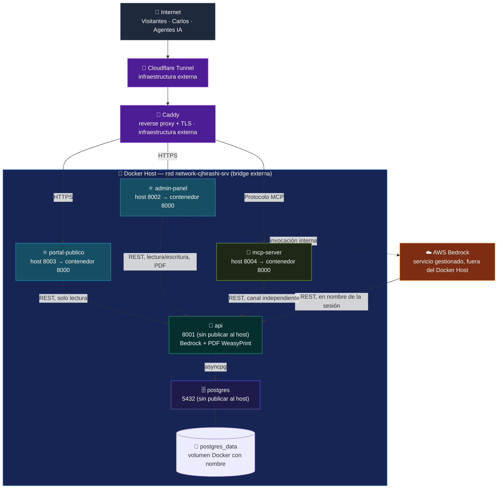

# Vista de Despliegue - cjhirashi-career

**VISTA DE DESPLIEGUE**

[]()
[]()
[]()

---

**Última actualización**: 2026-08-16
**Resumen rápido**: 4 módulos de aplicación + infra (Postgres, MinIO, Qdrant) · 3 puertos publicados al host (8002, 8003, 8004) · API interna (8001) con PDF WeasyPrint in-process · 1 red bridge externa compartida · Caddy + Cloudflare Tunnel como entrada externa

---

## 📋 Tabla de Contenidos

- [Cómo Leer Este Documento](#-cómo-leer-este-documento)
- [Diagrama de Despliegue](#-diagrama-de-despliegue)
- [Contenedores y Puertos](#-contenedores-y-puertos)
- [docker-compose.yml — Especificación Objetivo](#-docker-composeyml--especificación-objetivo)
- [Red Docker](#-red-docker)
- [Volúmenes](#-volúmenes)
- [Health Checks](#-health-checks)
- [Ambiente de Desarrollo](#-ambiente-de-desarrollo)
- [Ambiente de Producción](#-ambiente-de-producción)
- [Caddy y Cloudflare Tunnel](#-caddy-y-cloudflare-tunnel)

---

## 📖 Cómo Leer Este Documento

Este documento es la sección 7 de la documentación Arc42 y describe **dónde corre cada cosa**: contenedores, puertos, red, volúmenes y variables de entorno del sistema objetivo de siete módulos descrito en [01-INTRODUCTION.md](./01-INTRODUCTION.md). Es el **diseño objetivo** de despliegue — el `docker-compose.yml` especificado aquí es el que debe construirse; no describe la topología heredada del proyecto anterior (generador de documentos), que queda como base técnica reutilizable pero no como arquitectura vigente.

## 🚀 Diagrama de Despliegue



Ver [protocolo de paleta de colores](../COLOR_PALETTE.md) — el color de cada nodo es el mismo en todos los diagramas del proyecto, incluidos los de [01-INTRODUCTION.md](./01-INTRODUCTION.md#-diagrama-del-sistema) y [05-BUILDING-BLOCK-VIEW.md](./05-BUILDING-BLOCK-VIEW.md).

**Nota sobre Agent Bedrock**: es el único componente que no corre en el Docker Host — es un servicio gestionado de AWS, sin contenedor propio (ver [01-INTRODUCTION.md — Componente 4️⃣](./01-INTRODUCTION.md#4️⃣-agent-bedrock-asistente-interno-del-admin-panel)). Se representa fuera del `subgraph Host` para dejar explícito que su disponibilidad depende de la nube de AWS, no de este despliegue Docker.

## 🔌 Contenedores y Puertos

| Servicio (objetivo) | Nombre de contenedor sugerido | Puerto host | Puerto contenedor | Publicado al host |
|---|---|---|---|---|
| Portal Público | `portafolio_portal` | 8003 | 8000 | ✅ Sí |
| Admin Panel | `portafolio_admin` | 8002 | 8000 | ✅ Sí |
| MCP Server | `portafolio_mcp` | 8004 | 8000 | ✅ Sí |
| API REST | `api_rest` | — | 8001 | ❌ No |
| PostgreSQL | `postgres_db` | — | 5432 | ❌ No |
| Agent Bedrock | — (servicio gestionado, sin contenedor) | — | — | ❌ No aplica |

Todos los servicios contenedorizados deben declarar `restart: unless-stopped`, coherente con el patrón ya usado en el `docker-compose.yml` heredado del proyecto anterior.

## 📄 docker-compose.yml — Especificación Objetivo

Estructura de referencia para los contenedores de aplicación e infra (Bedrock y PDF viven in-process en la API):

```yaml
services:
  portal-publico:
    build: ./portal-publico
    container_name: portafolio_portal
    restart: unless-stopped
    ports:
      - "8003:8000"
    environment:
      - API_UPSTREAM=portafolio_api:8001
    networks:
      - network-cjhirashi-srv
    depends_on:
      - api

  admin-panel:
    build: ./admin-panel
    container_name: portafolio_admin
    restart: unless-stopped
    ports:
      - "8002:8000"
    environment:
      - API_UPSTREAM=portafolio_api:8001
      - METRICS_STREAM_PATH=/api/v1/metrics/stream
    networks:
      - network-cjhirashi-srv
    depends_on:
      - api

  mcp-server:
    build: ./mcp-server
    container_name: portafolio_mcp
    restart: unless-stopped
    ports:
      - "8004:8000"
    environment:
      - API_UPSTREAM=portafolio_api:8001
    networks:
      - network-cjhirashi-srv
    depends_on:
      - api

  api:
    build: ./api
    container_name: portafolio_api
    restart: unless-stopped
    environment:
      - DATABASE_URL=postgresql+asyncpg://<usuario>:<password>@postgres:5432/<db>
      - SECRET_KEY=<secreto, ver Notas de Seguridad en 08-CROSSCUTTING-CONCEPTS.md>
      - ALGORITHM=HS256
      - CORS_ORIGINS=http://localhost:8002 http://localhost:8003
      - BEDROCK_REGION=<región AWS>
      - BEDROCK_MODEL_ID=<identificador del modelo>
    networks:
      - network-cjhirashi-srv
    depends_on:
      postgres:
        condition: service_healthy
    healthcheck:
      test: ["CMD", "curl", "-f", "http://localhost:8001/health"]
      interval: 30s
      timeout: 5s
      retries: 3

  postgres:
    image: postgres:15-alpine
    container_name: portafolio_postgres
    restart: unless-stopped
    environment:
      - POSTGRES_USER=<usuario>
      - POSTGRES_PASSWORD=<password>
      - POSTGRES_DB=<db>
    volumes:
      - postgres_data:/var/lib/postgresql/data
      - ./cjhirashi-career-api/init.sql:/docker-entrypoint-initdb.d/init.sql:ro
    networks:
      - network-cjhirashi-srv
    healthcheck:
      test: ["CMD-SHELL", "pg_isready -U <usuario> -d <db>"]
      interval: 10s
      retries: 5

networks:
  network-cjhirashi-srv:
    external: true

volumes:
  postgres_data:
```

**Nota**: los valores entre `<>` son placeholders — las credenciales reales, la región de AWS y el identificador del modelo de Bedrock deben resolverse en variables de entorno o un gestor de secretos, nunca en texto plano versionado en Git (ver [08-CROSSCUTTING-CONCEPTS.md — Seguridad](./08-CROSSCUTTING-CONCEPTS.md#-seguridad)).

## 🌐 Red Docker

- **Nombre**: `network-cjhirashi-srv`
- **Tipo**: bridge, **externa** al proyecto (`external: true`) — debe existir de antemano en el host compartido `cjhirashi-srv`; este proyecto no la crea ni la administra (ver restricción de infraestructura en [02-ARCHITECTURE-GOALS.md — Restricciones](./02-ARCHITECTURE-GOALS.md#-restricciones)).
- **Resolución de nombres**: los contenedores se alcanzan entre sí por su `container_name` (por ejemplo, `portafolio_postgres:5432` desde `portafolio_api`, `portafolio_api:8001` referenciado por los tres canales de entrada vía la variable `API_UPSTREAM`).
- Todos los servicios del proyecto se conectan exclusivamente a esta única red — no hay redes internas adicionales ni segmentación por capa, consistente con el patrón ya usado en el despliegue heredado.

## 💾 Volúmenes

| Volumen | Tipo | Ruta en Host | Usado por | Propósito |
|---|---|---|---|---|
| **postgres_data** | Bind mount | `/mnt/disco1/cjhirashi-data/cjhirashi-career-volumes/postgres` | `postgres` | Persistencia de los tres dominios de datos (carrera, observabilidad, auditoría) entre reinicios/recreaciones del contenedor |
| **uploads** | Bind mount (lectura/escritura) | `/mnt/disco1/cjhirashi-data/cjhirashi-career-volumes/uploads` | `api` | Bucket de archivos: imágenes del portal, avatar de usuario, documentos necesarios para Admin Panel y Portal Público |
| **init.sql** | Bind mount (solo lectura) | `./cjhirashi-career-api/init.sql` → `/docker-entrypoint-initdb.d/init.sql` | `postgres` | Script de inicialización del esquema en el primer arranque |

**Carpeta base de volúmenes**: `/mnt/disco1/cjhirashi-data/cjhirashi-career-volumes/`
- **postgres/** — Base de datos persistente
- **uploads/** — Bucket de archivos (imágenes, documentos)
- **backups/** — Directorio para respaldos futuros de volúmenes

**Nota sobre PDFs**: Los PDFs se generan bajo demanda en memoria y se descargan directamente al usuario — **no se almacenan en disco del servidor**. El volumen `uploads` es solo para imágenes y archivos del sistema, no para PDFs.

## 🔍 Health Checks

| Servicio | Mecanismo objetivo |
|---|---|
| `postgres` | `pg_isready -U <usuario> -d <db>`, cada 10s, 5 reintentos |
| `api` | `GET http://localhost:8001/health`, cada 30s |
| `admin-panel` | `GET http://localhost:8000/` (o endpoint de salud equivalente de la SPA servida), cada 30s |
| `portal-publico` | `GET http://localhost:8000/` (o endpoint de salud equivalente), cada 30s |
| `mcp-server` | Handshake mínimo del protocolo MCP o endpoint de salud dedicado — a definir junto con el mecanismo de autenticación del canal (ver [01-INTRODUCTION.md — Preguntas de Validación Abiertas](./01-INTRODUCTION.md#-preguntas-de-validación-abiertas)) |
| Agent Bedrock | No aplica un health check propio en este despliegue — su disponibilidad se observa indirectamente a través del resultado de las llamadas que la API REST hace al SDK de AWS Bedrock |

`api` y `postgres` son los dos únicos servicios con dependencia explícita de salud (`depends_on: condition: service_healthy`) — el resto de contenedores dependen de `api` sin condición de salud estricta, siguiendo el mismo patrón ya usado en el despliegue heredado del proyecto anterior.

## 🧪 Ambiente de Desarrollo

```bash
# Desde la raíz del proyecto
docker compose build
docker compose up -d
```

- Todos los servicios corren en el mismo host Docker; no se contempla, en este alcance, un `docker-compose.override.yml` ni perfiles separados de desarrollo/producción — el sistema opera como una instancia única, coherente con el objetivo técnico de MVP de un único usuario administrador (ver [02-ARCHITECTURE-GOALS.md](./02-ARCHITECTURE-GOALS.md#-objetivos-técnicos)).
- Para desarrollo local de cada frontend (Portal Público, Admin Panel) fuera de Docker, se recomienda mantener el mismo patrón ya usado en el proyecto heredado: un proxy de desarrollo (por ejemplo, el proxy de Vite) que reenvíe las llamadas a la API REST hacia `API_UPSTREAM`, evitando problemas de CORS sin exponer nombres DNS internos de Docker al navegador.
- Swagger interactivo de la API REST disponible en `http://localhost:8001/docs` dentro de la red Docker, o expuesto puntualmente al host solo durante depuración local (nunca en producción, ver [Notas de Seguridad](./08-CROSSCUTTING-CONCEPTS.md#-seguridad)).

## 🏭 Ambiente de Producción

- **Hospedado en**: el mismo host Docker compartido `cjhirashi-srv` — no hay ambiente de producción separado ni pipeline de promoción entre ambientes; el sistema opera como instancia única.
- **Entrada de tráfico**: Cloudflare Tunnel → Caddy (reverse proxy, terminación TLS) → los contenedores publicados al host (`portal_publico:8003`, `admin_panel:8002`). Ninguno de los contenedores internos (`api_rest`, `postgres_db`, MinIO, Qdrant) debe ser alcanzable directamente desde Internet — ver la restricción explícita en [01-INTRODUCTION.md — Conexiones explícitamente prohibidas](./01-INTRODUCTION.md#-diagrama-del-sistema).
- **Base de datos**: sin réplicas ni backups automatizados definidos en este documento — pendiente de diseño, coherente con el alcance de MVP de un único usuario administrador.
- **Secretos**: `SECRET_KEY`, credenciales de PostgreSQL y credenciales de AWS Bedrock deben resolverse vía variables de entorno inyectadas en tiempo de despliegue o un gestor de secretos — nunca en texto plano versionado en `docker-compose.yml` (ver [08-CROSSCUTTING-CONCEPTS.md — Seguridad](./08-CROSSCUTTING-CONCEPTS.md#-seguridad)).

## 🔌 Caddy y Cloudflare Tunnel

Ninguno de los dos vive en este repositorio — son infraestructura compartida del host `cjhirashi-srv` que enruta tráfico externo hacia la red Docker `network-cjhirashi-srv`, en el mismo patrón ya usado por el proyecto heredado (ver [02-ARCHITECTURE-GOALS.md — Restricciones de infraestructura](./02-ARCHITECTURE-GOALS.md#-restricciones)). Este proyecto no define ni versiona su configuración; se documentan aquí únicamente como el punto de entrada conocido del tráfico real hacia los tres canales expuestos.

| Componente | Responsabilidad | Alcance de este proyecto |
|---|---|---|
| Cloudflare Tunnel | Expone el host `cjhirashi-srv` a Internet sin abrir puertos entrantes directos en el firewall | Ninguno — infraestructura externa administrada por el Administrador de `cjhirashi-srv` (ver [03-STAKEHOLDERS.md](./03-STAKEHOLDERS.md#-stakeholders-de-infraestructura)) |
| Caddy | Reverse proxy y terminación TLS; enruta cada subdominio/ruta hacia el puerto de host correspondiente (8002, 8003, 8004) | Este proyecto debe comunicar con anticipación cualquier cambio de puerto o de canal expuesto al Administrador de `cjhirashi-srv`, coherente con la matriz de prioridades de [03-STAKEHOLDERS.md](./03-STAKEHOLDERS.md#-matriz-de-prioridades) |

**Pendiente de definir**: la configuración exacta de enrutamiento de Caddy para el MCP Server (puerto 8004), dado que su protocolo no es HTTP tradicional de navegador sino el protocolo MCP consumido por clientes de agentes de IA — puede requerir reglas de proxy distintas a las de Portal Público y Admin Panel.

---

**Relacionado**: [01-INTRODUCTION.md](./01-INTRODUCTION.md) · [05-BUILDING-BLOCK-VIEW.md](./05-BUILDING-BLOCK-VIEW.md) · [06-RUNTIME-VIEW.md](./06-RUNTIME-VIEW.md) · [08-CROSSCUTTING-CONCEPTS.md](./08-CROSSCUTTING-CONCEPTS.md) · [CLAUDE.md](../CLAUDE.md)
**Contacto**: Carlos Jiménez Hirashi (cjhirashi@gmail.com)
