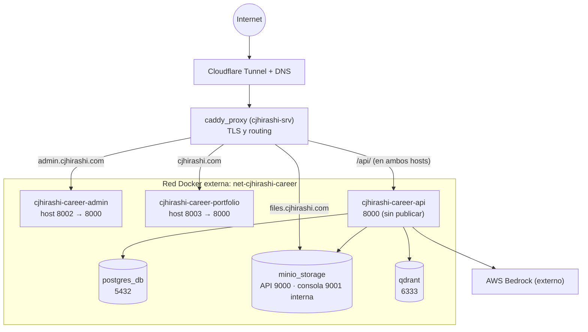

# Vista de despliegue - cjhirashi-career

**VISTA DE DESPLIEGUE** (arc42, sección 7)

**Última actualización**: 2026-11-05
**Resumen**: 6 contenedores definidos en `docker-compose.yml` (3 de aplicación + PostgreSQL, MinIO y Qdrant) en la red externa `net-cjhirashi-career`; solo 2 puertos publicados al host (8002 y 8003). La fuente de verdad es el propio `docker-compose.yml` y `caddy.json`.

---

## Diagrama de despliegue


```mermaid
graph TB
    Internet((Internet)) --> CF["Cloudflare Tunnel + DNS"]
    CF --> Caddy["caddy_proxy (cjhirashi-srv)<br/>TLS y routing"]

    subgraph Net["Red Docker externa: net-cjhirashi-career"]
        Admin["cjhirashi-career-admin<br/>host 8002 → 8000"]
        Portal["cjhirashi-career-portfolio<br/>host 8003 → 8000"]
        API["cjhirashi-career-api<br/>8000 (sin publicar)"]
        PG[("postgres_db<br/>5432")]
        S3[("minio_storage<br/>API 9000 · consola 9001 interna")]
        Q[("qdrant<br/>6333")]
    end

    Caddy -->|admin.cjhirashi.com| Admin
    Caddy -->|cjhirashi.com| Portal
    Caddy -->|files.cjhirashi.com| S3
    Caddy -->|"/api/ (en ambos hosts)"| API
    API --> PG
    API --> S3
    API --> Q
    API --> AWS["AWS Bedrock (externo)"]
```

## Contenedores y puertos

| Servicio (compose) | Contenedor | Imagen | Puerto | Exposición |
|---|---|---|---|---|
| `admin` | `cjhirashi-career-admin` | build local (Node 20, SPA servida) | 8002 → 8000 | `admin.cjhirashi.com` |
| `portfolio` | `cjhirashi-career-portfolio` | build local | 8003 → 8000 | `cjhirashi.com` |
| `api` | `cjhirashi-career-api` | build local (`python:3.11-slim`) | 8000 | Interna; `/api/` de los dos hosts, con prefijo removido |
| `postgres` | `postgres_db` | `postgres:15-alpine` | 5432 | Interna |
| `minio` | `minio_storage` | `minio/minio:latest` | 9000 (API), 9001 (consola) | `files.cjhirashi.com` (solo 9000); la consola no se expone |
| `qdrant` | `qdrant` | `qdrant/qdrant:latest` | 6333 | Interna. Retiro decidido (ADR-029, etapa 3 de la spec 009); la API depende de él (`depends_on`) |

No hay contenedor de MCP (se retiró el 2026-09-04, ADR-023) ni de `cjhirashi-career-ai`: ese harness (spec 009) está en construcción y no se despliega todavía.

## Contrato de red (`caddy.json`)

`caddy.json` es el contrato con `cjhirashi-srv`: `cjhirashi-srv` escribe el bloque `cjhirashi_srv` (red, hosts y estado) y este repo rellena `servicios`.

| Servicio | Host | Contenedor:puerto | Rutas |
|---|---|---|---|
| `admin` | `admin.cjhirashi.com` | `cjhirashi-career-admin:8000` | `/api/` → API (quitando el prefijo); `/` → Admin |
| `portafolio` | `cjhirashi.com` | `cjhirashi-career-portfolio:8000` | `/api/` → API (quitando el prefijo); `/` → Portal |
| `files` | `files.cjhirashi.com` | `minio_storage:9000` | `/` |

Tras cualquier cambio de exposición: `python3 bin/caddy-sync cjhirashi-career` desde el repo `cjhirashi-srv`. Los cambios de red o puertos se comunican por los `mensajes` del propio contrato.

## Variables de entorno

El compose lee `.env` (nunca versionado; plantilla en `.env.example`). Detalle y políticas de secretos: [ENVIRONMENT-SECURITY.md](./ENVIRONMENT-SECURITY.md). Dentro de la red, la API alcanza MinIO por el nombre del servicio (`minio:9000`), nunca por `localhost`.

## Red Docker

`net-cjhirashi-career` es una red *bridge* **externa** y dedicada, gestionada por `cjhirashi-srv` (el `caddy_proxy` ya está conectado). Migró desde la red compartida `network-cjhirashi-srv` (MSG-0001 y MSG-0004 del contrato). Declararla como `external: true` en el compose es obligatorio.

## Volúmenes

Rutas absolutas en el disco de datos (`volumes: {}` en el compose):

| Dato | Ruta del host |
|---|---|
| PostgreSQL | `/mnt/disco1/cjhirashi-data/cjhirashi-career-volumes/postgres` |
| MinIO | `/mnt/disco1/cjhirashi-data/cjhirashi-career-volumes/minio` |
| Qdrant | `/mnt/disco1/cjhirashi-data/cjhirashi-career-volumes/qdrant` |

## Health checks

| Servicio | Prueba |
|---|---|
| `admin`, `portfolio` | `wget` a `http://localhost:8000/` cada 30 s |
| `api` | `GET /health` (urllib) cada 30 s, 40 s de arranque, 3 reintentos; `GET /system/readiness` para comprobaciones de preparación |
| `postgres` | `pg_isready` cada 10 s |
| `minio` | `curl` a `/minio/health/live` cada 10 s |
| `qdrant` | sin healthcheck (la API arranca con `service_started`) |

La API arranca solo cuando PostgreSQL y MinIO están sanos.

## Desarrollo

```bash
cp .env.example .env
docker compose up -d --build            # todo el sistema
docker compose up -d --build api        # un servicio
docker compose logs -f api
```

Pruebas y arranque local por servicio: [AGENTS.md](../AGENTS.md) (sección «Comandos por subproyecto»). Verifica siempre el arranque real (`GET /health`), no solo que el contenedor exista.

## Producción

Es el mismo `docker-compose.yml` en `cjhirashi-srv`, detrás de Caddy y Cloudflare Tunnel (TLS terminado ahí). Despliegue: reconstruir el servicio (`docker compose up -d --build <servicio>`) y comprobar `GET /health`. Las migraciones se aplican con Alembic desde la API (`alembic upgrade head`); respaldo previo de PostgreSQL antes de cualquier migración con datos.

---

**Relacionado**: [01-INTRODUCTION.md](./01-INTRODUCTION.md) · [05-BUILDING-BLOCK-VIEW.md](./05-BUILDING-BLOCK-VIEW.md) · [ENVIRONMENT-SECURITY.md](./ENVIRONMENT-SECURITY.md)
**Contacto**: cjhirashi@gmail.com
