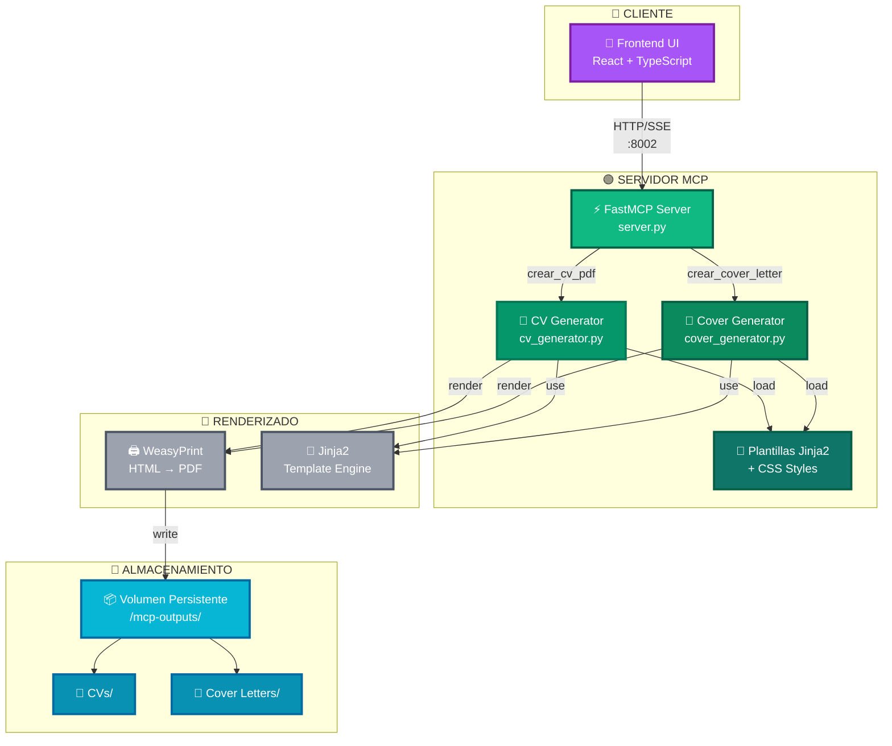
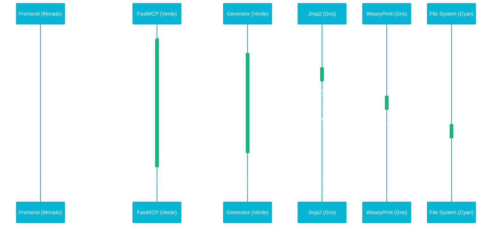
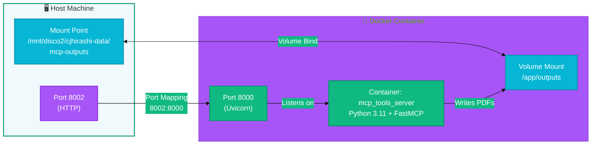

# Arquitectura del Sistema — MCP Tools Server

_Diagramas y descripción de la arquitectura completa del sistema MCP Tools Server._

## Diagrama de Arquitectura General



## Descripción de Componentes

### Cliente (Morado - #A855F7)

**Frontend UI**: Aplicación React basada en TypeScript con Tailwind CSS. Proporciona:
- Formulario para ingresar datos del CV
- Formulario para ingresar datos de cover letter
- Visualización y descarga de PDFs generados
- Interfaz responsiva y moderna

**Comunicación**: Envía solicitudes HTTP/SSE al servidor MCP en puerto 8002.

### Servidor MCP (Verde - #10B981)

**FastMCP Server** (`server.py`): Punto de entrada central que expone dos herramientas MCP:
- `crear_cv_pdf(datos_cv_json, nombre_archivo)` → Genera CV en PDF
- `crear_cover_letter_pdf(datos_cover_json, nombre_archivo)` → Genera cover letter en PDF

**CV Generator** (`cv_generator.py`): Lógica de generación de CV:
1. Parsea JSON de entrada
2. Carga plantilla `cv_template.html`
3. Renderiza Jinja2 con datos
4. Aplica estilos CSS (paged media)
5. Convierte a PDF con WeasyPrint
6. Guarda en `/mcp-outputs/cvs/`

**Cover Generator** (`cover_generator.py`): Lógica de generación de cover letter:
1. Parsea JSON de entrada
2. Carga plantilla `cover_template.html`
3. Renderiza Jinja2 con datos
4. Aplica estilos CSS (paged media)
5. Convierte a PDF con WeasyPrint
6. Guarda en `/mcp-outputs/cover_letters/`

**Plantillas y Estilos**: 
- `cv_template.html`: Estructura del CV en HTML/Jinja2
- `cover_template.html`: Estructura de cover letter en HTML/Jinja2
- `css/style_1.css`: Estilos compartidos con media queries para impresión

### Almacenamiento (Cyan - #06B6D4)

**Volumen Persistente**: `/mnt/disco2/cjhirashi-data/mcp-outputs/`
- **CVs**: Contiene todos los PDFs de CV generados
- **Cover Letters**: Contiene todos los PDFs de cover letters generados

Los archivos persisten entre reinicios del contenedor y están accesibles desde el host.

### Dependencias Externas (Gris - #f0f9fc)

**WeasyPrint**: Motor de renderización HTML → PDF
- Soporta CSS paged media (@page, @page:first, márgenes, etc.)
- Resuelve base URLs para cargar CSS e imágenes
- Genera PDFs profesionales con layout exacto

**Jinja2**: Motor de plantillas HTML
- Permite variables, loops, condicionales en plantillas
- Aplica filtros de formato
- Integración directa con Python

---

## Flujo de Datos Completo



---

## Topología de Red (Docker)



---

## Decisiones de Diseño Clave

### 1. FastMCP como Framework

**Por qué**: 
- Abstracción clara del protocolo MCP
- Decoradores `@mcp.tool()` para exponer funciones como herramientas
- Manejo automático de SSE
- Integración sencilla con Uvicorn

**Alternativas consideradas**:
- Implementar MCP manual (más control, más código)
- Usar servidor genérico (menos específico)

### 2. Jinja2 + WeasyPrint para PDF

**Por qué**:
- Jinja2: Plantillas HTML dinámicas, fácil de mantener
- WeasyPrint: CSS paged media (print media queries), control total sobre layout
- Combinación permite diseños profesionales y reproducibles

**Flujo**:
```
JSON → Jinja2 render → HTML → WeasyPrint → PDF
```

### 3. Volúmenes Persistentes

**Por qué**:
- Los PDFs generados persisten entre reinicios
- Accesibles desde el host para descarga/archivo
- Separación clara entre contenedor y host

**Ubicación**: `/mnt/disco2/cjhirashi-data/mcp-outputs/`

### 4. Separación de Generadores

**Por qué**:
- Cada documento tiene lógica independiente
- Plantillas separadas (cv_template.html, cover_template.html)
- Fácil de mantener y extender
- Posibilidad de agregar nuevos tipos de documentos

### 5. CSS Paged Media

**Por qué**:
- Control preciso de márgenes, saltos de página
- Estilos específicos para primera página (`@page:first`)
- Media queries para impresión (@media print)
- Resultado reproducible y profesional

---

## Escalabilidad y Mejoras Futuras

### Escalabilidad Actual

- **Procesamiento**: Secuencial (una solicitud a la vez por instancia)
- **Múltiples instancias**: Soportadas detrás de load balancer
- **Almacenamiento**: Limitado por espacio en disco host

### Mejoras Propuestas

1. **Cola de trabajos** (Celery + Redis)
   - Procesar PDFs en background
   - Notificar cuando esté listo
   - Mejorar experiencia de usuario

2. **Caché de plantillas compiladas**
   - Cachear Jinja2 templates
   - Reducir tiempo de renderizado

3. **Generación paralela**
   - Procesar múltiples PDFs simultáneamente
   - Thread pool o async/await

4. **Soporte de múltiples plantillas**
   - Parámetro `template_name` en llamadas
   - Biblioteca de diseños

5. **Firma digital y marcas de agua**
   - Agregar seguridad a documentos
   - Personalización adicional

---

## Referencias

- [COLOR_PALETTE.md](../COLOR_PALETTE.md) — Paleta de colores del proyecto
- [CLAUDE.md](../CLAUDE.md) — Guía de desarrollo
- [Guia PDF WeasyPrint y CSS paged media.md](../server/Guia%20PDF%20WeasyPrint%20y%20CSS%20paged%20media.md) — Detalles técnicos de PDF

**Diagrama actualizado**: 2026-08-15
