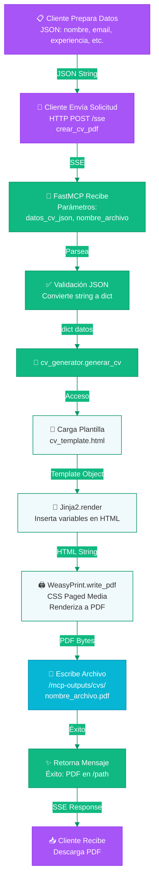
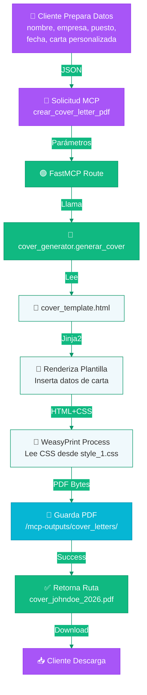
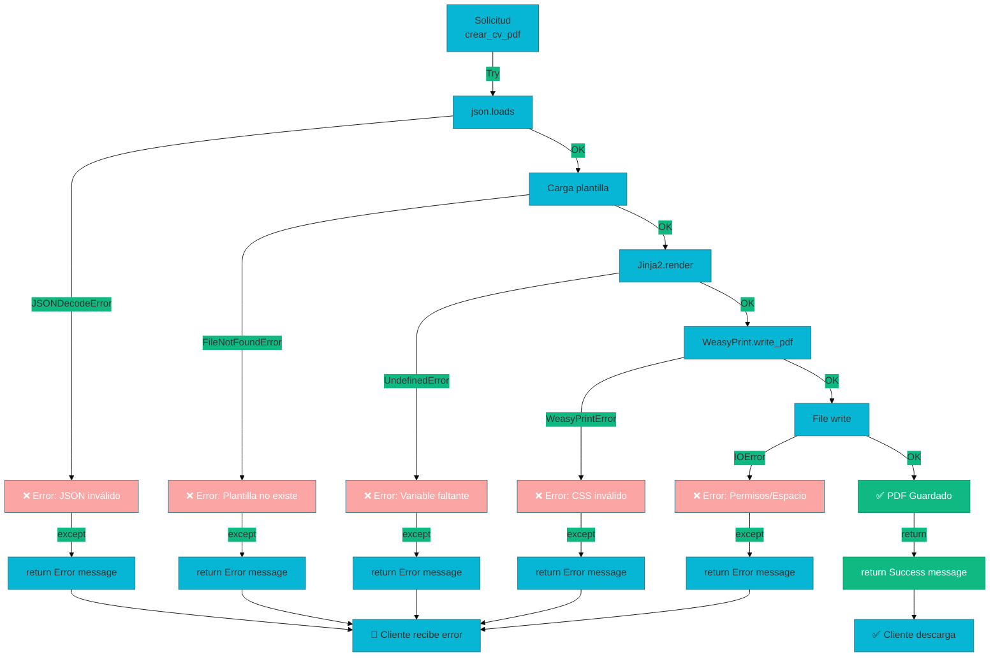

# Flujo de Datos — MCP Tools Server

_Análisis detallado del flujo de datos en cada operación del servidor._

## Flujo de Generación de CV

Proceso completo desde solicitud del cliente hasta PDF guardado:



### Puntos Críticos del Flujo

| Paso | Componente | Entrada | Salida | Error Posible |
|------|-----------|---------|--------|---------------|
| 1 | Cliente | Datos CV | JSON string | Validación cliente-side |
| 2 | FastMCP | JSON string | dict Python | JSON inválido |
| 3 | cv_generator | dict | Template | Error de parseo |
| 4 | Jinja2 | Template + datos | HTML string | Variable faltante |
| 5 | WeasyPrint | HTML | PDF bytes | CSS inválido, fuente faltante |
| 6 | File System | PDF bytes | archivo guardado | Permisos, espacio en disco |
| 7 | Cliente | Ruta archivo | Descarga | Red |

---

## Flujo de Generación de Cover Letter

Similar al CV, con plantilla específica:



---

## Estructuras de Datos

### JSON de Entrada (CV)

```json
{
  "nombre": "Juan Pérez",
  "email": "juan@ejemplo.com",
  "telefono": "+34 600 123 456",
  "titulo_profesional": "Senior Backend Engineer",
  "resumen": "10 años de experiencia en desarrollo backend...",
  "experiencia": [
    {
      "empresa": "Tech Corp",
      "puesto": "Senior Engineer",
      "fechas": "2020 - 2026",
      "descripcion": "Desarrollo de microservicios..."
    }
  ],
  "educacion": [
    {
      "institucion": "Universidad",
      "titulo": "Licenciatura en Informática",
      "año": "2015"
    }
  ],
  "habilidades": ["Python", "JavaScript", "Docker", "Kubernetes"]
}
```

### JSON de Entrada (Cover Letter)

```json
{
  "nombre": "Juan Pérez",
  "fecha": "2026-08-15",
  "empresa": "Innovate Inc",
  "posicion": "Backend Developer",
  "contacto_empresa": "hr@innovate.com",
  "saludo": "Dear Hiring Manager,",
  "cuerpo": "I am writing to express my interest...",
  "despedida": "Sincerely, Juan Pérez"
}
```

### Estructura Interna Python

```python
# CV Generator
datos_cv = {
    'nombre': 'Juan Pérez',
    'email': 'juan@ejemplo.com',
    # ... más campos
}

# Template render
html = jinja_template.render(**datos_cv)  # Interpola variables

# WeasyPrint
pdf = weasyprint.HTML(
    string=html,
    base_url=templates_dir  # Para resolver CSS relativo
).write_pdf()
```

---

## Transformaciones de Datos

### Cadena de Transformación: JSON → HTML → PDF

```mermaid
%%{init: {
  'theme': 'base',
  'themeVariables': {
    'primaryColor': '#06B6D4',
    'secondaryColor': '#10B981',
    'tertiaryColor': '#A855F7'
  }
}}%%

graph LR
  JSON["<b>Formato JSON</b><br/>String (cliente)<br/>Data de entrada"] -->|"json.loads()"| DICT["<b>Dict Python</b><br/>Estructura de datos<br/>Variables"]
  DICT -->|"template.render(**dict)"| HTML["<b>HTML String</b><br/>HTML + CSS<br/>Estructura visual"]
  HTML -->|"WeasyPrint.write_pdf()"| PDF["<b>PDF Bytes</b><br/>Documento PDF<br/>Formato final"]
  PDF -->|"File Write"| FILE["<b>Archivo PDF</b><br/>En disco<br/>Descargable"]

  style JSON fill:#A855F7,stroke:#9333EA,color:#fff
  style DICT fill:#10B981,stroke:#059669,color:#fff
  style HTML fill:#f0f9fc,stroke:#059669,color:#333
  style PDF fill:#06B6D4,stroke:#0891B2,color:#fff
  style FILE fill:#06B6D4,stroke:#0891B2,color:#fff
```



### Detalle de Transformación HTML → PDF

WeasyPrint aplica las siguientes transformaciones:

1. **Parseo HTML**: Valida estructura HTML
2. **Resolución de URLs**: Encuentra CSS, imágenes usando `base_url`
3. **Aplicación de CSS**: 
   - Cascada de estilos (inline → style tags → external CSS)
   - Media queries (@media print)
   - Paged media (@page rules)
4. **Renderizado de contenido**:
   - Textos (con fuentes)
   - Imágenes (rasterización)
   - Tablas (layout)
5. **Paginación**:
   - Saltos de página (@page, page-break)
   - Márgenes definidos en CSS
6. **Generación PDF**:
   - Compresión de imágenes
   - Metadatos (título, autor)
   - Compresión de streams
7. **Escritura a disco**: Bytes PDF → archivo

---

## Manejo de Errores

### Posibles Excepciones y Recuperación



### Códigos de Error Comunes

| Error | Causa | Solución |
|-------|-------|----------|
| `JSON decode error` | JSON inválido en entrada | Validar JSON antes de enviar |
| `Template not found` | Plantilla no existe | Verificar que cv_template.html existe |
| `UndefinedError` | Variable en plantilla no definida | Agregar variable faltante en JSON |
| `CSS parse error` | CSS inválido en style_1.css | Validar sintaxis CSS |
| `Permission denied` | No puede escribir en `/mcp-outputs/` | Verificar permisos de carpeta |
| `No space left` | Disco lleno | Limpiar archivos antiguos |
| `Image not found` | Referencia a imagen que no existe | Usar rutas relativas correctas |

---

## Optimizaciones de Flujo

### Caché de Plantillas (Propuesto)

```python
# Actual: Carga plantilla en cada solicitud
env = Environment(loader=FileSystemLoader(templates_dir))
template = env.get_template("cv_template.html")

# Propuesto: Caché global
TEMPLATE_CACHE = {}
template = TEMPLATE_CACHE.get("cv_template.html") or env.get_template("cv_template.html")
TEMPLATE_CACHE["cv_template.html"] = template
```

**Beneficio**: Reduce I/O de disco, tiempo de renderizado ~10-20%

### Paralelización (Propuesto)

```python
# Actual: Secuencial
pdf1 = generar_cv(datos1)
pdf2 = generar_cv(datos2)

# Propuesto: Paralelo con ThreadPool
with ThreadPoolExecutor(max_workers=4) as executor:
    pdf1 = executor.submit(generar_cv, datos1)
    pdf2 = executor.submit(generar_cv, datos2)
```

**Beneficio**: Procesar múltiples documentos simultáneamente

---

## Referencias

- [ARCHITECTURE.md](./ARCHITECTURE.md) — Diagramas arquitectónicos
- [NETWORK_TOPOLOGY.md](./NETWORK_TOPOLOGY.md) — Topología de red
- [COLOR_PALETTE.md](../COLOR_PALETTE.md) — Paleta de colores usada

**Actualizado**: 2026-08-15
