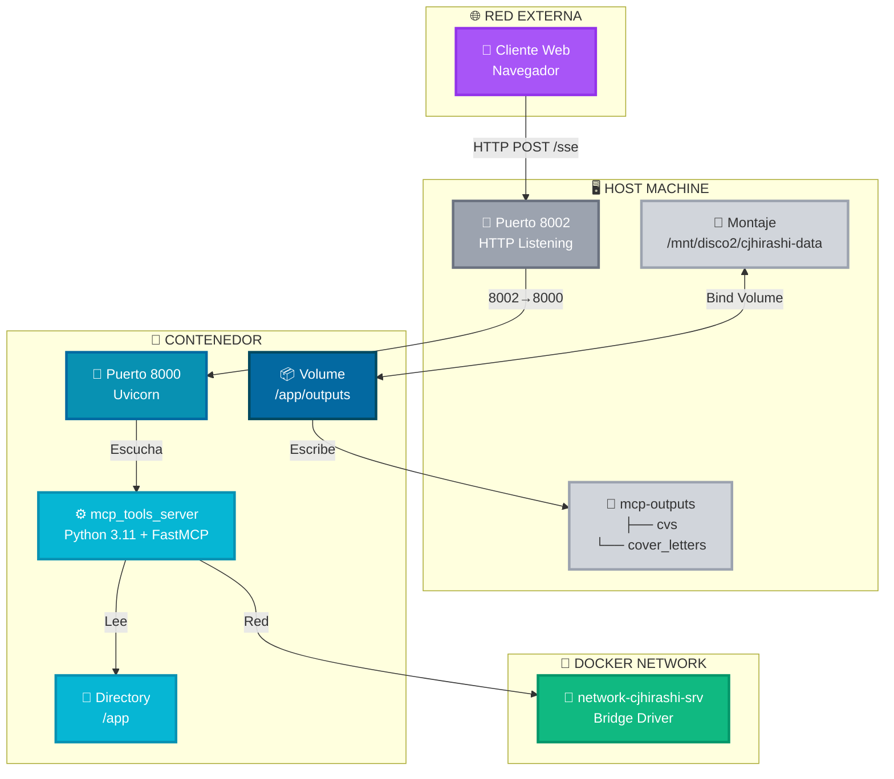
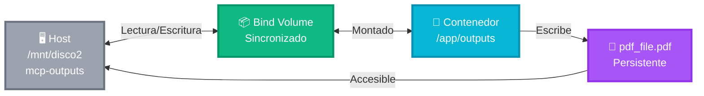
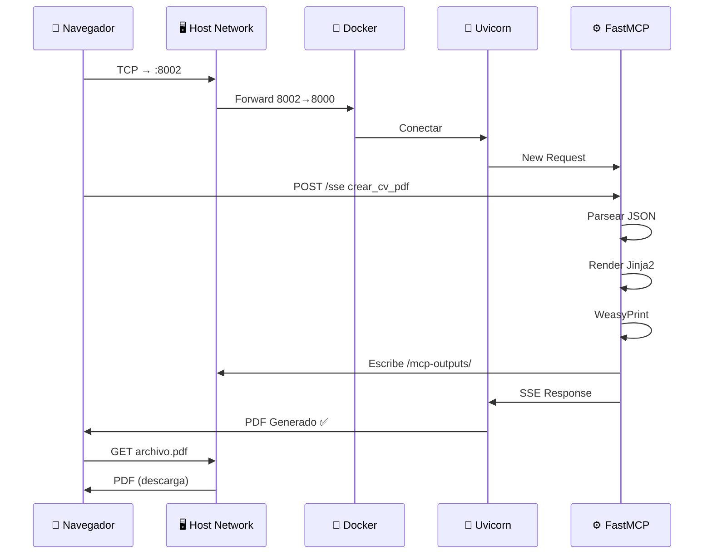

# Topología de Red — MCP Tools Server

_Configuración de red, puertos, volúmenes y conectividad del sistema._

## Diagrama de Topología General



## Configuración de Puertos

### Puerto Mapeado

| Dirección | Puerto Host | Puerto Contenedor | Protocolo | Uso |
|-----------|-------------|-------------------|-----------|-----|
| **Entrada** | 8002 | 8000 | HTTP | MCP Client → Uvicorn Server |
| **Escucha** | 0.0.0.0:8002 | 0.0.0.0:8000 | TCP | FastMCP Server |

### Explicación

- **Host 8002** ← Puerto expuesto en la máquina host
- **Contenedor 8000** ← Puerto interno donde escucha Uvicorn
- **Mapping**: `docker-compose.yml` define `ports: ["8002:8000"]`

```yaml
# docker-compose.yml
services:
  mcp_tools_server:
    ports:
      - "8002:8000"  # Host:Container
```

### Conexión desde Cliente

```
Cliente (navegador)
  ↓
http://localhost:8002/sse   (HTTP/SSE)
  ↓
Docker Port Mapping 8002→8000
  ↓
Uvicorn en 0.0.0.0:8000
  ↓
FastMCP Handler
```

---

## Configuración de Volúmenes

### Bind Volume: Host ↔ Contenedor



### Configuración en docker-compose.yml

```yaml
volumes:
  # Bind volume: permite persistencia y acceso desde host
  - /mnt/disco2/cjhirashi-data/mcp-outputs:/app/outputs
```

### Estructura de Directorios

**En Host:**
```
/mnt/disco2/cjhirashi-data/
└── mcp-outputs/
    ├── cvs/                    ← CVs generados
    │   ├── cv_john_2026.pdf
    │   ├── cv_jane_2026.pdf
    │   └── ...
    └── cover_letters/          ← Cover letters generados
        ├── cover_john_2026.pdf
        ├── cover_jane_2026.pdf
        └── ...
```

**En Contenedor:**
```
/app/
├── outputs/                    ← Montaje de /mnt/disco2/.../mcp-outputs/
│   ├── cvs/
│   ├── cover_letters/
├── server.py
├── tools/
├── templates/
└── ...
```

### Ventajas del Bind Volume

1. **Persistencia**: PDFs permanecen después de reiniciar contenedor
2. **Acceso Host**: Fácil lectura desde la máquina host
3. **Backups**: Directorio en host = fácil de respaldar
4. **Permisos**: Controlados por sistema de archivos host
5. **Rendimiento**: Mejor que Docker named volumes para I/O intenso

---

## Red Docker

### Tipo de Red

```yaml
networks:
  network-cjhirashi-srv:
    driver: bridge
    external: true
```

**Bridge Network**: Red virtual que conecta contenedores entre sí y con el host.

### Características

| Característica | Valor |
|---|---|
| **Tipo** | Bridge (virtual) |
| **Controlador** | bridge |
| **Aislamiento** | Contenedores en la misma red se ven entre sí |
| **Acceso Host** | Vía localhost:8002 |
| **Externo** | `external: true` — Red creada externamente |

### Resolución de Nombres en la Red

```
Dentro de la red bridge:
- Nombre: mcp_tools_server
- Dirección IP: Dinámica (ej: 172.20.0.2)
- Accesible desde: Otros contenedores en la misma red
```

---

## Flujo de Solicitud HTTP



---

## Configuración de docker-compose.yml

Archivo completo de orquestación:

```yaml
version: '3.8'

services:
  mcp_tools_server:
    # Imagen y construcción
    build:
      context: .
      dockerfile: Dockerfile
    image: mcp-server-mcp-tools:latest
    container_name: mcp_tools_server
    
    # Puertos expuestos
    ports:
      - "8002:8000"  # HTTP: Host:Container
    
    # Volúmenes (persistencia)
    volumes:
      - /mnt/disco2/cjhirashi-data/mcp-outputs:/app/outputs
      # Templates se pueden montar opcionalmente para hot-reload
      # - ./templates:/app/templates
    
    # Red
    networks:
      - network-cjhirashi-srv
    
    # Reinicio automático
    restart: unless-stopped
    
    # Logging
    logging:
      driver: "json-file"
      options:
        max-size: "10m"
        max-file: "3"
    
    # Variables de entorno (opcionales)
    environment:
      - PYTHONUNBUFFERED=1
      - APP_ENV=production
    
    # Health check (propuesto)
    healthcheck:
      test: ["CMD", "curl", "-f", "http://localhost:8000/health"]
      interval: 30s
      timeout: 10s
      retries: 3
      start_period: 20s

networks:
  network-cjhirashi-srv:
    external: true
    driver: bridge
```

---

## Seguridad de Red

### Configuración Actual

| Aspecto | Actual | Riesgo |
|--------|--------|--------|
| **Puerto Público** | 8002 (HTTP) | Expuesto a red local |
| **Autenticación** | Ninguna | Cualquiera puede enviar solicitudes |
| **TLS/SSL** | No configurado | Datos en texto plano (HTTP) |
| **Red Docker** | Bridge local | Solo accesible desde host |

### Mejoras Propuestas

1. **HTTPS Reverse Proxy**
   - Usar Nginx/Caddy delante de Uvicorn
   - Terminar TLS en proxy
   - Certificados Let's Encrypt

2. **Autenticación**
   - API Key en headers
   - Bearer tokens
   - Validación de origen

3. **Rate Limiting**
   - Limitar solicitudes por IP
   - Prevenir abuso
   - Alertas de anomalías

4. **Firewall Host**
   - iptables para restricción de acceso
   - Solo IPs autorizadas a puerto 8002

---

## Monitoreo y Diagnóstico

### Verificar Conectividad

```bash
# Desde host: ¿Está el puerto escuchando?
netstat -tlnp | grep 8002
ss -tlnp | grep 8002

# Desde host: ¿Responde el servidor?
curl http://localhost:8002/sse

# Desde contenedor: ¿Está activo?
docker ps -a | grep mcp_tools_server
docker logs mcp_tools_server
```

### Verificar Volúmenes

```bash
# Ver volúmenes del contenedor
docker inspect mcp_tools_server | grep -A 10 "Mounts"

# Ver contenido de volumen desde host
ls -la /mnt/disco2/cjhirashi-data/mcp-outputs/
ls -la /mnt/disco2/cjhirashi-data/mcp-outputs/cvs/
ls -la /mnt/disco2/cjhirashi-data/mcp-outputs/cover_letters/

# Acceso desde contenedor
docker exec -it mcp_tools_server ls -la /app/outputs/
docker exec -it mcp_tools_server du -sh /app/outputs/
```

### Monitoreo de Red

```bash
# Ver interfaces de red del contenedor
docker exec mcp_tools_server ip addr show

# Ver conexiones activas del contenedor
docker exec mcp_tools_server netstat -tlnp

# Verificar conectividad a otros servicios
docker exec mcp_tools_server curl http://otra-app:8080
```

---

## Referencias

- [ARCHITECTURE.md](./ARCHITECTURE.md) — Arquitectura del sistema
- [DATA_FLOW.md](./DATA_FLOW.md) — Flujo de datos
- [COLOR_PALETTE.md](../COLOR_PALETTE.md) — Paleta de colores de documentación
- [docker-compose.yml](../docker-compose.yml) — Configuración completa

**Actualizado**: 2026-08-15
