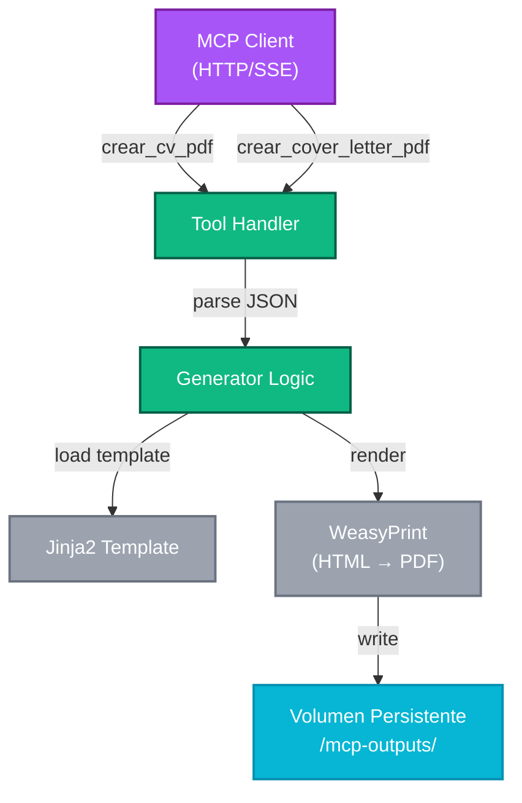

# Referencia de API — Herramientas MCP

Documentación técnica completa de las herramientas MCP que expone el servidor **MCP Tools Server**.

---

## Visión General

El servidor MCP Tools expone **dos herramientas principales** decoradas con `@mcp.tool()` en FastMCP:

1. **`crear_cv_pdf`** — Genera un CV profesional en PDF
2. **`crear_cover_letter_pdf`** — Genera una carta de presentación en PDF

Ambas herramientas:
- Aceptan JSON estructurado como entrada
- Renderizan plantillas Jinja2 personalizadas
- Aplican estilos CSS paged media optimizados para impresión
- Retornan un mensaje de éxito o error

---

## Herramienta 1: `crear_cv_pdf`

### Descripción

Genera un documento PDF profesional de CV a partir de datos estructurados en JSON.

### Firma

```python
@mcp.tool()
def crear_cv_pdf(datos_cv_json: str, nombre_archivo: str) -> str:
    """
    Genera un PDF de CV profesional.
    
    Args:
        datos_cv_json: JSON string con datos del CV
        nombre_archivo: Nombre del archivo PDF (ej: "cv_juan_perez.pdf")
    
    Returns:
        Mensaje de éxito o error
    """
```

### Parámetros

| Parámetro | Tipo | Requerido | Descripción |
|-----------|------|----------|-------------|
| **datos_cv_json** | string | Sí | JSON serializado con datos del CV. Debe ser un string válido JSON. |
| **nombre_archivo** | string | Sí | Nombre del archivo PDF a generar (ej: `cv_johndoe.pdf`). |

### Estructura JSON del CV

El JSON debe incluir los siguientes campos (ejemplo completo):

```json
{
  "nombre": "Juan Pérez García",
  "email": "juan.perez@example.com",
  "telefono": "+34 600 123 456",
  "ubicacion": "Madrid, España",
  "titulo_profesional": "Senior Software Engineer",
  "resumen": "Ingeniero de software con 8 años de experiencia en desarrollo backend...",
  
  "experiencia": [
    {
      "empresa": "Acme Inc",
      "puesto": "Senior Engineer",
      "años": "2020-2024",
      "descripcion": "Lideré la arquitectura de microservicios..."
    },
    {
      "empresa": "Tech Startup",
      "puesto": "Full Stack Developer",
      "años": "2018-2020",
      "descripcion": "Desarrollé APIs REST con FastAPI..."
    }
  ],
  
  "educacion": [
    {
      "institucion": "Universidad Politécnica de Madrid",
      "carrera": "Ingeniería Informática",
      "año": "2015"
    },
    {
      "institucion": "Google Cloud Academy",
      "carrera": "Professional Cloud Architect",
      "año": "2021"
    }
  ],
  
  "skills": [
    "Python",
    "JavaScript",
    "Docker",
    "Kubernetes",
    "PostgreSQL",
    "FastAPI",
    "React"
  ],
  
  "idiomas": [
    {
      "idioma": "Español",
      "nivel": "Nativo"
    },
    {
      "idioma": "Inglés",
      "nivel": "Fluido (C1)"
    }
  ],
  
  "certificaciones": [
    {
      "nombre": "AWS Certified Solutions Architect",
      "emisor": "Amazon Web Services",
      "año": "2023"
    }
  ],
  
  "enlaces": [
    {
      "nombre": "GitHub",
      "url": "https://github.com/juanperez"
    },
    {
      "nombre": "LinkedIn",
      "url": "https://linkedin.com/in/juanperez"
    }
  ]
}
```

### Campos Soportados

| Campo | Tipo | Opcional | Descripción |
|-------|------|----------|-------------|
| **nombre** | string | No | Nombre completo del candidato |
| **email** | string | No | Email de contacto |
| **telefono** | string | Sí | Número de teléfono |
| **ubicacion** | string | Sí | Ciudad, país |
| **titulo_profesional** | string | Sí | Título o puesto actual |
| **resumen** | string | Sí | Resumen profesional (2-3 líneas) |
| **experiencia** | array | Sí | Lista de experiencias laborales |
| **educacion** | array | Sí | Lista de formación académica |
| **skills** | array | Sí | Lista de habilidades técnicas |
| **idiomas** | array | Sí | Lista de idiomas con nivel |
| **certificaciones** | array | Sí | Certificaciones profesionales |
| **enlaces** | array | Sí | Links a GitHub, LinkedIn, etc. |

### Respuesta

**Éxito:**
```
Éxito: PDF generado correctamente en '/mnt/disco2/cjhirashi-data/mcp-outputs/cvs/cv_johndoe.pdf'
```

**Error (JSON inválido):**
```
Error generando PDF: Expecting value: line 1 column 1 (char 0)
```

**Error (Template no encontrado):**
```
Error generando PDF: cv_template.html not found in templates directory
```

### Ubicación del Archivo Generado

```
/mnt/disco2/cjhirashi-data/mcp-outputs/cvs/{nombre_archivo}
```

### Ejemplo de Uso (Python)

```python
import json

# Datos del CV
datos_cv = {
    "nombre": "Juan Pérez",
    "email": "juan@example.com",
    "titulo_profesional": "Senior Engineer",
    "experiencia": [
        {
            "empresa": "Acme Inc",
            "puesto": "Engineer",
            "años": "2020-2024"
        }
    ]
}

# Serializar a JSON string
datos_cv_json = json.dumps(datos_cv)

# Llamar a la herramienta MCP
resultado = crear_cv_pdf(
    datos_cv_json=datos_cv_json,
    nombre_archivo="cv_juan.pdf"
)

print(resultado)
# Output: Éxito: PDF generado correctamente en '...'
```

---

## Herramienta 2: `crear_cover_letter_pdf`

### Descripción

Genera un documento PDF de carta de presentación a partir de datos estructurados.

### Firma

```python
@mcp.tool()
def crear_cover_letter_pdf(datos_cover_json: str, nombre_archivo: str) -> str:
    """
    Genera un PDF de carta de presentación profesional.
    
    Args:
        datos_cover_json: JSON string con datos de la cover letter
        nombre_archivo: Nombre del archivo PDF
    
    Returns:
        Mensaje de éxito o error
    """
```

### Parámetros

| Parámetro | Tipo | Requerido | Descripción |
|-----------|------|----------|-------------|
| **datos_cover_json** | string | Sí | JSON serializado con datos de la carta. |
| **nombre_archivo** | string | Sí | Nombre del archivo PDF a generar. |

### Estructura JSON de Cover Letter

```json
{
  "nombre": "Juan Pérez García",
  "email": "juan.perez@example.com",
  "telefono": "+34 600 123 456",
  "fecha": "2026-08-15",
  
  "empresa": "Acme Inc",
  "puesto": "Senior Software Engineer",
  "nombre_contacto": "María García",
  
  "cuerpo": "Estimado equipo de reclutamiento de Acme Inc,\n\nMe dirijo a ustedes con entusiasmo para expresar mi interés en la posición de Senior Software Engineer...",
  
  "clausura": "Atentamente,",
  
  "firma": "Juan Pérez García"
}
```

### Campos Soportados

| Campo | Tipo | Opcional | Descripción |
|-------|------|----------|-------------|
| **nombre** | string | No | Nombre completo |
| **email** | string | No | Email de contacto |
| **telefono** | string | Sí | Teléfono |
| **fecha** | string | Sí | Fecha de la carta (YYYY-MM-DD) |
| **empresa** | string | No | Nombre de la empresa destino |
| **puesto** | string | No | Puesto al que aplica |
| **nombre_contacto** | string | Sí | Nombre del manager/contacto |
| **cuerpo** | string | Sí | Cuerpo de la carta (párrafos) |
| **clausura** | string | Sí | Cierre (ej: "Atentamente") |
| **firma** | string | Sí | Nombre en la firma |

### Respuesta

**Éxito:**
```
Éxito: PDF generado correctamente en '/mnt/disco2/cjhirashi-data/mcp-outputs/cover_letters/cover_juan.pdf'
```

**Error:**
```
Error generando PDF: [descripción del error]
```

### Ubicación del Archivo Generado

```
/mnt/disco2/cjhirashi-data/mcp-outputs/cover_letters/{nombre_archivo}
```

### Ejemplo de Uso (Python)

```python
import json

# Datos de la cover letter
datos_cover = {
    "nombre": "Juan Pérez",
    "email": "juan@example.com",
    "empresa": "Acme Inc",
    "puesto": "Senior Engineer",
    "cuerpo": "Estimado equipo...",
    "clausura": "Atentamente"
}

# Serializar a JSON
datos_cover_json = json.dumps(datos_cover)

# Llamar a la herramienta MCP
resultado = crear_cover_letter_pdf(
    datos_cover_json=datos_cover_json,
    nombre_archivo="cover_juan.pdf"
)

print(resultado)
```

---

## Flujo Completo de Generación

### Arquitectura de Herramientas



---

## Validación de Entrada

### Validaciones Obligatorias

1. **JSON válido**: El string debe ser JSON válido
2. **Campos requeridos**: Cada herramienta valida sus campos obligatorios
3. **Tipo de datos**: Los valores deben coincidir con los tipos esperados

### Ejemplos de Errores Comunes

| Error | Causa | Solución |
|-------|-------|----------|
| `Expecting value: line 1 column 1` | JSON inválido (comillas mal escapadas) | Verifica `json.dumps()` antes de enviar |
| `KeyError: 'nombre'` | Campo requerido faltante | Incluye todos los campos obligatorios |
| `TypeError: expected str` | Tipo de dato incorrecto | Asegúrate de que los valores sean del tipo correcto |

---

## Personalización de Plantillas

Las plantillas se encuentran en:
- **CV:** `server/templates/cv_template.html`
- **Cover Letter:** `server/templates/cover_template.html`
- **Estilos:** `server/templates/css/style_1.css`

Para modificarlas:

1. Edita el archivo HTML o CSS en `server/templates/`
2. No requiere rebuild de Docker (los templates se montan como volumen)
3. Recarga la página para ver los cambios

Ver [../../server/README.md](../../server/README.md) para más detalles.

---

## Limites y Restricciones

| Límite | Valor | Notas |
|--------|-------|-------|
| **Tamaño máximo de JSON** | Sin límite explícito | WeasyPrint puede ser lento con documentos muy grandes |
| **Campos personalizados** | No soportados | Solo los campos en la estructura estándar |
| **Múltiples plantillas** | No (en esta versión) | Se planea soporte futuro |
| **Rate limiting** | Sin implementar | En roadmap futuro |

---

## Documentación Adicional

- **[../architecture/README.md](../architecture/README.md)** — Cómo funciona internamente
- **[../../server/README.md](../../server/README.md)** — Implementación técnica completa
- **[../../../CLAUDE.md](../../../CLAUDE.md)** — Patrones de desarrollo

---

**Última actualización:** 2026-08-15  
**Versión API:** 1.0  
**Contacto:** Carlos (cjhirashi@gmail.com)
