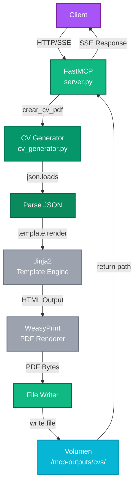
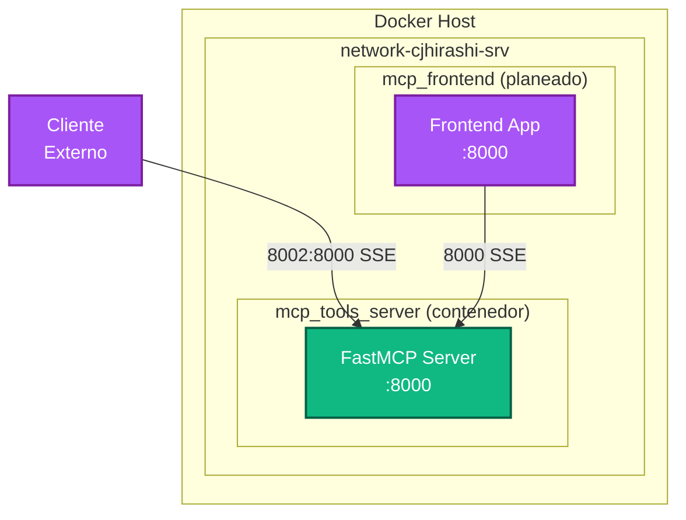
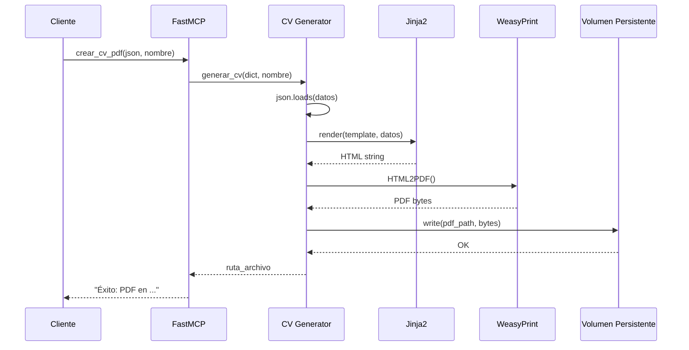

# Arquitectura y Diseño — MCP Tools Server

Documentación completa de la arquitectura del sistema, diagramas interactivos y decisiones de diseño.

---

## Visión General de la Arquitectura

MCP Tools Server es un sistema modular de tres capas que genera documentos profesionales en PDF:

```
┌─────────────────────────────────────────────────────────┐
│  CAPA DE CLIENTE (Morado #A855F7)                       │
│  - Clientes MCP, Frontend, Usuarios                     │
└─────────────────────────────────────────────────────────┘
                          ↓ SSE / HTTP
┌─────────────────────────────────────────────────────────┐
│  CAPA DE SERVIDOR (Verde #10B981)                       │
│  - FastMCP Server, Generators, Jinja2 Templates         │
└─────────────────────────────────────────────────────────┘
                          ↓
┌─────────────────────────────────────────────────────────┐
│  CAPA DE ALMACENAMIENTO (Cyan #06B6D4)                  │
│  - Volumen Persistente, PDFs, Configuración             │
└─────────────────────────────────────────────────────────┘
```

---

## Componentes del Sistema

### 1. Cliente (Morado #A855F7)

**Descripción:** Interfaz que inicia la generación de documentos.

**Componentes:**
- **Frontend Web** (React + TypeScript, en desarrollo)
- **Clientes MCP** (Claude, otros agentes, herramientas externas)
- **Scripts/CLI** (para testing y automatización)

**Responsabilidades:**
- Recopilar datos (JSON)
- Validar entrada básica
- Enviar solicitudes al servidor MCP

**Puerto:** 8003 (Frontend, planeado)

---

### 2. Servidor MCP (Verde #10B981)

**Descripción:** Core del sistema que procesa solicitudes y genera PDFs.

**Componentes Principales:**

#### a. FastMCP Server (`server.py`)
- Punto de entrada del proyecto
- Define decoradores `@mcp.tool()`
- Expone dos herramientas: `crear_cv_pdf` y `crear_cover_letter_pdf`
- Comunica vía **SSE (Server-Sent Events)**
- Puerto interno: 8000 | Puerto expuesto: 8002

#### b. CV Generator (`tools/cv_generator.py`)
```python
def generar_cv(datos: dict, nombre_archivo: str) -> str:
    # Valida datos JSON
    # Carga template cv_template.html
    # Renderiza con Jinja2
    # Aplica CSS paged media
    # Genera PDF con WeasyPrint
    # Retorna ruta del archivo
```

**Entrada:** Diccionario con datos del CV  
**Salida:** Ruta del PDF generado

#### c. Cover Letter Generator (`tools/cover_generator.py`)
```python
def generar_cover_letter(datos: dict, nombre_archivo: str) -> str:
    # Similar a CV generator pero para cover letters
```

#### d. Jinja2 Templates
- `cv_template.html` — Estructura HTML del CV
- `cover_template.html` — Estructura HTML de cover letter
- `css/style_1.css` — Estilos globales + media queries para PDF

**Responsabilidades del Servidor:**
- Validar JSON de entrada
- Renderizar templates con datos
- Aplicar estilos CSS
- Generar PDF con WeasyPrint
- Almacenar archivos en volumen persistente
- Retornar resultado al cliente

---

### 3. Almacenamiento (Cyan #06B6D4)

**Ubicación:** `/mnt/disco2/cjhirashi-data/mcp-outputs`

**Estructura:**
```
mcp-outputs/
├── cvs/
│   ├── cv_juan_perez.pdf
│   ├── cv_maria_garcia.pdf
│   └── ...
└── cover_letters/
    ├── cover_juan.pdf
    ├── cover_maria.pdf
    └── ...
```

**Características:**
- Volumen Docker persistente
- Montado en ambos contenedores (lectura)
- Accesible desde el host
- Retención indefinida (sin política de limpieza automática)

---

## Flujo de Datos Completo

### Generación de CV



**Pasos detallados:**

1. **Cliente envía solicitud** → JSON con datos del CV
2. **FastMCP recibe** → Valida que sea una solicitud MCP válida
3. **Generator parsea JSON** → Convierte string JSON en diccionario Python
4. **Jinja2 renderiza** → Sustituye variables en template HTML
5. **WeasyPrint renderiza** → HTML → PDF bytes
6. **File Writer guarda** → PDF en disco en volumen persistente
7. **Retorna ruta** → Mensaje de éxito con ruta del archivo

---

## Arquitectura de Red Docker



**Características:**
- **Red:** `network-cjhirashi-srv` (externa, compartida)
- **Aislamiento:** Cada contenedor tiene su propio namespace de red
- **Puertos:**
  - Servidor MCP: `8002 (host) → 8000 (contenedor)`
  - Frontend (planeado): `8003 (host) → 8000 (contenedor)`

---

## Decisiones de Diseño Clave

### 1. Arquitectura de Dos Contenedores

**Decisión:** Separar servidor MCP y frontend en contenedores independientes.

**Justificación:**
- Escalabilidad independiente
- Ciclos de desarrollo desacoplados
- Deployment flexible
- Orquestación central en `docker-compose.yml` (raíz)

**Alternativa rechazada:** Monolito único (reduces complejidad operacional pero acoplaba frontend/backend)

---

### 2. Transporte SSE (Server-Sent Events)

**Decisión:** Usar SSE en lugar de WebSocket o REST tradicional.

**Justificación:**
- Nativamente compatible con MCP
- Conexiones HTTP estándar (sin upgrades)
- Soporte en navegadores sin librerías especiales
- Simétrico con el protocolo MCP

---

### 3. Almacenamiento en Volumen Persistente

**Decisión:** PDFs en volumen Docker en lugar de memoria o base de datos.

**Justificación:**
- Durabilidad garantizada
- Acceso directo desde el host
- Bajo costo de almacenamiento
- Fácil de respaldar

**Camino alternativo:** Base de datos (PostgreSQL) para metadata + S3 para archivos (escalado futuro)

---

### 4. Jinja2 + WeasyPrint para PDF

**Decisión:** Renderizado HTML → PDF con WeasyPrint.

**Justificación:**
- Control total sobre diseño (CSS)
- Reutilización de templates web
- Soporte para CSS paged media (print)
- Alternativa: reportlab (más complejo, menos flexible)

---

### 5. Sin Base de Datos (v1.0)

**Decisión:** Almacenamiento directo en disco, sin metadata en BD.

**Justificación:**
- Simplicidad para MVP
- Reduce overhead operacional
- Suficiente para tracking básico (filesystem)

**Próxima fase:** Agregar PostgreSQL para metadata, búsqueda, auditoría

---

## Extensibilidad

### Agregar un Nuevo Tipo de Documento

1. Crear generador en `server/tools/x_generator.py`
2. Crear template en `server/templates/x_template.html`
3. Registrar herramienta en `server/server.py`:
   ```python
   @mcp.tool()
   def crear_x_pdf(datos_x_json: str, nombre_archivo: str) -> str:
       return crear_x(json.loads(datos_x_json), nombre_archivo)
   ```
4. Actualizar documentación en [../api/README.md](../api/README.md)

### Optimizaciones Propuestas

| Mejora | Beneficio | Complejidad |
|--------|----------|------------|
| Caché de templates compiladas | 5-10% más rápido | Baja |
| Rate limiting por cliente | Seguridad | Media |
| Soporte para múltiples plantillas | Flexibilidad | Alta |
| Base de datos de metadata | Búsqueda, auditoría | Alta |
| Sistema de colas (Celery) | Generación async | Alta |

---

## Monitoreo y Observabilidad

### Logs

**Ubicación:** stdout del contenedor Docker

```bash
docker logs mcp_tools_server -f
```

**Niveles:** INFO, WARNING, ERROR

**Incluye:**
- Solicitudes HTTP entrantes
- Errores de parsing JSON
- Excepciones de WeasyPrint
- Rutas de archivos generados

### Health Checks

Propuesto (no implementado):
- Endpoint `GET /health` → `{"status": "ok"}`
- Verificar accesibilidad del volumen

---

## Dependencias Externas

| Dependencia | Versión | Propósito | Licencia |
|-------------|---------|----------|---------|
| **FastMCP** | Latest | MCP Framework | MIT |
| **WeasyPrint** | Latest | PDF Rendering | BSD 3-Clause |
| **Jinja2** | Latest | Template Engine | BSD 3-Clause |
| **Python** | 3.11+ | Runtime | PSF |

---

## Roadmap de Arquitectura

### Fase 1 (v1.0 - Actual)
- [x] Dos herramientas MCP (CV, Cover)
- [x] Transporte SSE
- [x] Volumen persistente
- [x] Templates HTML + CSS

### Fase 2 (v1.1)
- [ ] Frontend web completo
- [ ] Health checks
- [ ] Rate limiting
- [ ] Caché de templates

### Fase 3 (v2.0)
- [ ] Base de datos PostgreSQL
- [ ] Sistema de colas (Celery)
- [ ] Soporte para múltiples plantillas
- [ ] Autenticación/Autorización
- [ ] S3 para almacenamiento escalado

---

## Diagramas Adicionales

### Secuencia de Generación de CV



---

## Referencias Cruzadas

- **[../getting-started/README.md](../getting-started/README.md)** — Cómo iniciar rápidamente
- **[../api/README.md](../api/README.md)** — Referencia técnica de herramientas
- **[../network/README.md](../network/README.md)** — Topología de red y configuración
- **[../../CLAUDE.md](../../CLAUDE.md)** — Patrones de desarrollo
- **[../../server/README.md](../../server/README.md)** — Implementación técnica completa

---

**Última actualización:** 2026-08-15  
**Versión:** 1.0  
**Contacto:** Carlos (cjhirashi@gmail.com)
