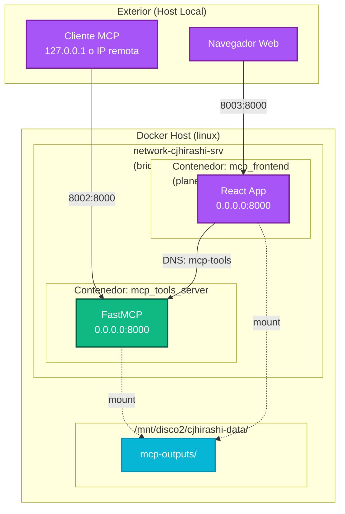
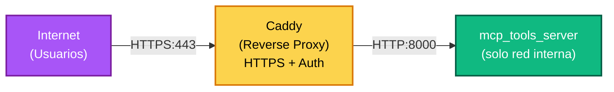

# Topología de Red y Configuración — MCP Tools Server

Documentación detallada de la configuración de red Docker, puertos, volúmenes y monitoreo del sistema.

---

## Visión General de la Red

MCP Tools Server se ejecuta en **Docker Compose** con orquestación desde la raíz del proyecto. El sistema utiliza una **red Docker externa** para comunicación entre servicios.

```
┌─────────────────────────────────────────────────────────┐
│  Docker Host (linux)                                     │
│                                                          │
│  ┌──────────────────────────────────────────────────┐   │
│  │ network-cjhirashi-srv (bridge, externa)          │   │
│  │                                                  │   │
│  │  ┌────────────────────┐  ┌──────────────────┐  │   │
│  │  │ mcp_tools_server   │  │ mcp_frontend     │  │   │
│  │  │ (FastMCP)          │  │ (React, planeado)│  │   │
│  │  │ :8000              │  │ :8000            │  │   │
│  │  └────────────────────┘  └──────────────────┘  │   │
│  └──────────────────────────────────────────────────┘   │
│         ↑ 8002:8000             ↑ 8003:8000             │
│                                                          │
└─────────────────────────────────────────────────────────┘
        ↑                                  ↑
    Cliente MCP                      Frontend Web
```

---

## Configuración de Puertos

### Servidor MCP (mcp_tools_server)

| Dirección | Puerto | Protocolo | Propósito |
|-----------|--------|----------|----------|
| **Host** | `8002` | HTTP/SSE | Acceso externo al servidor MCP |
| **Contenedor** | `8000` | HTTP/SSE | FastMCP + Uvicorn internamente |

**Exposición:**
```yaml
# docker-compose.yml
services:
  mcp-tools:
    ports:
      - "8002:8000"
```

**URL de acceso:**
```
http://<IP_HOST>:8002/sse
```

**Cambiar puerto (si hay conflicto):**
```yaml
ports:
  - "8004:8000"  # Usa 8004 en lugar de 8002
```

---

### Frontend Web (mcp_frontend)

| Dirección | Puerto | Protocolo | Propósito |
|-----------|--------|----------|----------|
| **Host** | `8003` | HTTP | Acceso externo al frontend |
| **Contenedor** | `8000` | HTTP | Servidor web internamente |

**Estado:** Definido en `docker-compose.yml` pero en desarrollo (comentado)

**Comunicación con Servidor MCP:**
- Frontend → mcp_tools_server: Conecta internamente a `http://mcp-tools:8000/sse`
- Red: `network-cjhirashi-srv` (servicio `mcp-tools`)

---

## Topología de Red Docker



---

## Volúmenes Persistentes

### Volumen Principal: `mcp-outputs`

**Ruta en Host:**
```
/mnt/disco2/cjhirashi-data/mcp-outputs
```

**Estructura en Contenedor:**
```
/mnt/disco2/cjhirashi-data/mcp-outputs/
├── cvs/                    # PDFs de CV generados
│   ├── cv_juan.pdf
│   ├── cv_maria.pdf
│   └── ...
└── cover_letters/          # PDFs de cover letters
    ├── cover_juan.pdf
    ├── cover_maria.pdf
    └── ...
```

**Configuración en docker-compose.yml:**
```yaml
services:
  mcp-tools:
    volumes:
      - /mnt/disco2/cjhirashi-data/mcp-outputs:/mnt/disco2/cjhirashi-data/mcp-outputs
```

**Tipo de volumen:** Bind mount (host → contenedor)

**Permisos:**
- Contenedor debe tener permiso de escritura
- Host debe permitir acceso: `chmod 755 /mnt/disco2/cjhirashi-data/mcp-outputs`

**Retención:**
- Indefinida (sin política de limpieza automática)
- Los archivos se guardan en disco y persisten después de que el contenedor se detiene

---

### Verificar Volúmenes Montados

```bash
# Ver montajes en el contenedor
docker inspect mcp_tools_server | grep -A 10 "Mounts"

# Ver espacio usado
df -h /mnt/disco2/cjhirashi-data/mcp-outputs

# Listar archivos
ls -lah /mnt/disco2/cjhirashi-data/mcp-outputs/cvs/
ls -lah /mnt/disco2/cjhirashi-data/mcp-outputs/cover_letters/
```

---

## Flujo de Solicitudes HTTP

### Generación de CV (Request/Response)

```
1. CLIENT
   ├─ POST http://localhost:8002/sse
   └─ Headers: Content-Type: application/json
   └─ Body: { 
       "tool": "crear_cv_pdf",
       "arguments": {
         "datos_cv_json": "{}",
         "nombre_archivo": "cv.pdf"
       }
     }

2. HOST (iptables/docker-proxy)
   ├─ Traduce: 8002 → 8000
   └─ Reenvía a contenedor mcp_tools_server

3. CONTENEDOR (FastMCP Server)
   ├─ Recibe en 0.0.0.0:8000
   ├─ Parsea solicitud MCP
   ├─ Llama a crear_cv_pdf()
   ├─ Genera PDF
   └─ Retorna respuesta SSE

4. CLIENT (SSE Response)
   └─ data: "Éxito: PDF en /mnt/disco2/cjhirashi-data/mcp-outputs/cvs/cv.pdf"
```

---

## Configuración de Red en docker-compose.yml

```yaml
version: '3.9'

services:
  mcp-tools:
    image: mcp-server-mcp-tools:latest
    build:
      context: ./server
      dockerfile: Dockerfile
    container_name: mcp_tools_server
    
    # Puertos
    ports:
      - "8002:8000"                # Host:Container
    
    # Volúmenes
    volumes:
      - /mnt/disco2/cjhirashi-data/mcp-outputs:/mnt/disco2/cjhirashi-data/mcp-outputs
    
    # Red
    networks:
      - network-cjhirashi-srv      # External bridge network
    
    # Reinicio
    restart: unless-stopped
    
    # Logs
    logging:
      driver: "json-file"
      options:
        max-size: "10m"
        max-file: "3"

networks:
  network-cjhirashi-srv:
    external: true                 # Ya existe, no crear
    driver: bridge
```

---

## Conectividad Entre Servicios

### Resolución de DNS

Dentro de `network-cjhirashi-srv`, los servicios se resuelven por nombre:

```
Hostname interno: mcp-tools
IP asignada: 172.18.0.2 (ejemplo, varía)
Acceso desde otros contenedores: http://mcp-tools:8000/sse
```

### Ejemplo: Frontend → Servidor MCP

```javascript
// En frontend/src/api.js
const response = await fetch('http://mcp-tools:8000/sse', {
  method: 'POST',
  headers: { 'Content-Type': 'application/json' },
  body: JSON.stringify({ tool: 'crear_cv_pdf', ... })
});
```

---

## Seguridad de Red

### Recomendaciones Actuales

| Aspecto | Implementado | Recomendación |
|--------|-------------|----------|
| **Aislamiento de red** | ✓ Bridge network externa | Suficiente para desarrollo |
| **Autenticación** | ✗ No | Implementar para producción |
| **Encriptación TLS** | ✗ No | Usar HTTPS + reverse proxy (Caddy) |
| **Rate limiting** | ✗ No | Implementar en gateway |
| **Firewall** | ✓ Nativo de Docker | Permitir solo 8002 desde cliente |

### Arquitectura de Producción Propuesta



---

## Monitoreo de Red

### Verificar Conectividad

```bash
# ¿Está corriendo el contenedor?
docker ps | grep mcp_tools_server

# ¿Está escuchando en el puerto?
docker exec mcp_tools_server netstat -tuln | grep 8000

# ¿Responde a solicitudes?
curl -X GET http://localhost:8002/health
```

### Ver Logs de Red

```bash
# Logs en tiempo real
docker logs mcp_tools_server -f

# Ver últimas 50 líneas
docker logs mcp_tools_server --tail 50

# Filtrar por palabra clave
docker logs mcp_tools_server | grep "ERROR"
```

### Métricas de Rendimiento

**Propuesto (no implementado):**

```bash
# Ver uso de CPU y memoria
docker stats mcp_tools_server

# Ver ancho de banda de red
docker exec mcp_tools_server iftop -n  # si está instalado
```

---

## Solución de Problemas de Red

### Problema: Puerto 8002 ya en uso

**Síntoma:**
```
Error: bind: address already in use
```

**Soluciones:**

1. **Ver qué proceso usa el puerto:**
   ```bash
   lsof -i :8002
   # o
   netstat -tuln | grep 8002
   ```

2. **Cambiar el puerto en docker-compose.yml:**
   ```yaml
   ports:
     - "8004:8000"
   ```

3. **Detener el contenedor anterior:**
   ```bash
   docker compose down
   docker compose up -d --force-recreate mcp-tools
   ```

---

### Problema: El frontend no puede alcanzar al servidor MCP

**Síntoma:** Error de conexión en el frontend

**Causa:** Frontend usando `localhost:8002` en lugar de DNS interno

**Solución:**

```javascript
// ✗ INCORRECTO (solo funciona desde host)
const url = 'http://localhost:8002/sse';

// ✓ CORRECTO (dentro del contenedor)
const url = 'http://mcp-tools:8000/sse';
```

---

### Problema: Volumen no está sincronizado

**Síntoma:** PDFs no aparecen en `/mnt/disco2/cjhirashi-data/mcp-outputs`

**Diagnóstico:**

```bash
# Ver volúmenes montados
docker inspect mcp_tools_server | grep -A 10 "Mounts"

# Verificar que exista el directorio
ls -lad /mnt/disco2/cjhirashi-data/mcp-outputs

# Verificar permisos
stat /mnt/disco2/cjhirashi-data/mcp-outputs
```

**Solución:**

```bash
# Crear directorio si no existe
mkdir -p /mnt/disco2/cjhirashi-data/mcp-outputs/cvs
mkdir -p /mnt/disco2/cjhirashi-data/mcp-outputs/cover_letters

# Ajustar permisos
chmod 755 /mnt/disco2/cjhirashi-data/mcp-outputs
chmod 755 /mnt/disco2/cjhirashi-data/mcp-outputs/cvs
chmod 755 /mnt/disco2/cjhirashi-data/mcp-outputs/cover_letters

# Reiniciar contenedor
docker compose down
docker compose up -d mcp-tools
```

---

## Configuración Avanzada

### Limitar Recursos de Red

```yaml
# docker-compose.yml
services:
  mcp-tools:
    # Limitar CPU y memoria
    deploy:
      resources:
        limits:
          cpus: '2'
          memory: 1G
        reservations:
          cpus: '1'
          memory: 512M
    
    # Rate limiting (propuesto)
    environment:
      - MAX_CONCURRENT_REQUESTS=10
      - REQUESTS_PER_MINUTE=60
```

### Logging Centralizado

```yaml
# Enviar logs a archivo host
logging:
  driver: "json-file"
  options:
    max-size: "10m"
    max-file: "3"
    labels: "com.example.vendor=Acme"
```

---

## Checklist de Configuración de Red

- [ ] Red `network-cjhirashi-srv` existe y es accesible
- [ ] Puerto 8002 no está en uso en el host
- [ ] Volumen `/mnt/disco2/cjhirashi-data/mcp-outputs` existe
- [ ] Permisos de volumen permiten escritura desde contenedor
- [ ] Servidor responde en `http://localhost:8002/sse`
- [ ] Logs no muestran errores de conexión
- [ ] Frontend (si existe) alcanza al servidor en `http://mcp-tools:8000/sse`

---

## Referencias Cruzadas

- **[../getting-started/README.md](../getting-started/README.md)** — Instalación rápida
- **[../architecture/README.md](../architecture/README.md)** — Diseño de arquitectura
- **[../api/README.md](../api/README.md)** — Referencia de herramientas
- **[../../docker-compose.yml](../../docker-compose.yml)** — Configuración completa
- **[../../CLAUDE.md](../../CLAUDE.md)** — Troubleshooting avanzado

---

**Última actualización:** 2026-08-15  
**Versión:** 1.0  
**Contacto:** Carlos (cjhirashi@gmail.com)
